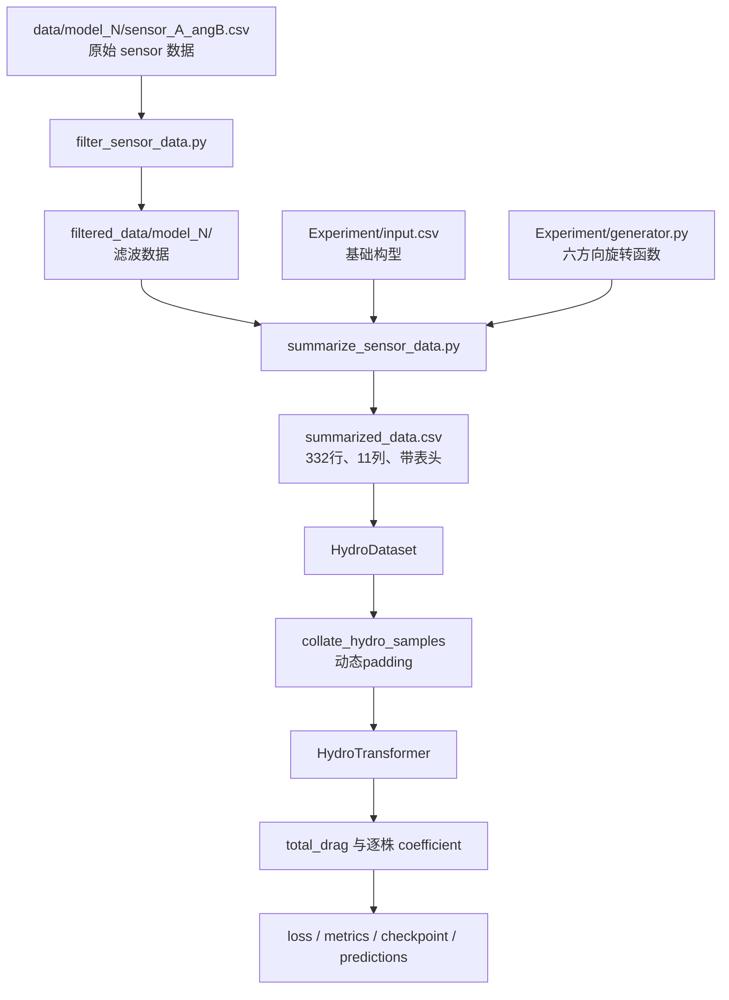
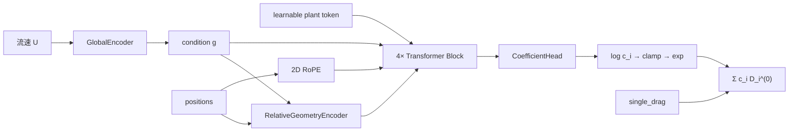

# `model` 文件夹脚本详细说明

## 1. 文档目的与阅读方式

本文档解释 `model/` 文件夹中每个脚本、配置文件、数据文件和测试文件的作用。默认读者只掌握 Python 基础语法，因此第一次出现项目术语时都会解释，并重点说明：

- 一个文件为什么存在；
- 它从哪里读取数据、向哪里写数据；
- 每个主要类、函数和方法接收什么参数；
- 输入和输出 Tensor（张量，多维数值数组）的 shape；
- 函数返回什么、可能抛出什么异常、是否会修改文件或模型状态；
- 从原始汇总数据到模型预测结果的完整调用关系。

推荐按以下顺序阅读：

1. 先读第 2～5 节，建立目录、术语和全流程概念；
2. 如果只想重新生成总 CSV，读第 6～8 节；
3. 如果想理解 Transformer，读第 9～17 节；
4. 如果想训练或评估模型，读第 18～29 节；
5. 遇到错误时查第 32 节。

文中的 `文件.py:起始行-结束行` 是源码位置。代码调整后行号可能移动，应同时根据类名或函数名搜索。

---

## 2. 文件夹结构

```text
model/
├── __init__.py                    # 把 model 标记为 Python package
├── train.py                       # overfit、5 折交叉验证、最终重训入口
├── evaluate.py                    # checkpoint 独立评估入口
├── plan.md                        # 模型最初的物理与架构设计方案
├── README.md                      # 面向使用者的快速命令说明
├── 模型文件夹脚本详细说明.md       # 本文档
├── requirements.txt               # Python 依赖
├── configs/
│   ├── base.yaml                  # 默认数据、模型和训练参数
│   └── physical.yaml              # 双状态角度分组与八个单株实测阻力
├── hydro/
│   ├── __init__.py                # 数据层公开接口
│   ├── geometry.py                # 六边形坐标和构型解析
│   ├── physics.py                 # 物理配置解析、校验和阻力查表
│   └── data.py                    # Dataset 和动态 padding
├── models/
│   ├── __init__.py                # 网络层公开接口
│   ├── global_encoder.py          # 流速条件编码
│   ├── conditional_norm.py        # FiLM 与 Conditional LayerNorm
│   ├── rope_2d.py                 # 二维 RoPE
│   ├── relative_geometry.py       # 成对相对位置编码
│   ├── attention.py               # 水动力多头 Attention
│   ├── transformer_block.py       # 完整 Transformer block
│   ├── coefficient_head.py        # 每株 latent coefficient 输出头
│   └── model.py                   # HydroTransformer 总模型
├── training/
│   ├── __init__.py                # 训练工具公开接口
│   ├── artifacts.py               # 训练产物目录安全清理与 ownership marker
│   ├── config.py                  # YAML 读取与配置合并
│   ├── splits.py                  # sample/model/plant_count/flow_speed 四种划分
│   ├── losses.py                  # 稳定化相对总阻力 MSE 与 train-only 分母拟合
│   ├── metrics.py                 # 回归指标
│   ├── scheduler.py               # warmup + cosine 学习率
│   ├── checkpoint.py              # 模型状态保存与恢复
│   ├── trainer.py                 # 训练循环、预测和产物写出
│   └── visualization.py           # validation/test 的三折线阻力图
├── tests/                          # 数据、模型、训练和 checkpoint 回归测试
└── artifacts/                     # 默认训练产物目录，由仓库根 .gitignore 忽略
```

`package` 可以理解为“允许其他 Python 文件使用 `import model...` 导入的代码目录”。目录中的 `__init__.py` 就是 package 标记和公开接口清单。

---

## 3. 需要先理解的术语

### 3.1 样本、构型和工况

- **构型（layout）**：37 个六边形格点中哪些位置安装了水草，用长度 37 的 `01` 字符串表示。
- **model_id**：基础构型编号。例如 `model_5` 对应 `Experiment/input.csv` 第 5 行。
- **angle**：构型相对基础方向顺时针旋转的角度，只允许 `0、60、120、180、240、300`。
- **工况**：一个构型、一个角度和一个流速的组合。
- **样本**：总 CSV 中的一行。当前共有 332 个真实工况，因此有 332 个样本。

### 3.2 Tensor shape 符号

| 符号 | 含义 |
|---|---|
| `B` | batch size，一次送入模型的样本数 |
| `N` | 当前 batch padding 后的最大水草数 |
| `D` | `d_model`，每株水草隐藏特征的维度 |
| `H` | attention head 数量 |
| `Dh` | 每个 head 的维度，`Dh = D / H` |
| `G` | 全局特征数量，当前只有流速，所以 `G=1` |

例如 `positions [B,N,2]` 表示：一个 batch 有 `B` 个样本，每个样本最多 `N` 株水草，每株用二维坐标 `(x,y)` 表示。

### 3.3 训练相关术语

- **batch**：一次计算若干样本，而不是一次只计算一行。
- **epoch**：模型完整遍历一次训练集。
- **step**：优化器更新一次参数。一个 epoch 通常包含多个 step。
- **loss**：训练时要最小化的误差函数。
- **validation**：训练过程中选最佳模型的数据，不参与参数更新。
- **test**：训练完成后报告泛化效果的数据，不能参与调参。
- **checkpoint**：保存模型权重、优化器、学习率调度器、配置和训练进度的文件。
- **overfit 检查**：故意用很少数据训练，确认代码能否把小数据拟合下来。它是排错工具，不是性能结论。
- **latent coefficient**：模型内部学到的潜在系数。只有总阻力监督时，它不能直接解释为真实单株阻力。

---

## 4. 整体数据流



最重要的两条防重复处理规则是：

1. `summarized_data.csv` 的 `vegetation_layout` 已经是按该行 `angle` 旋转后的水草排列，Dataset 不再旋转坐标；
2. `summarized_data.csv` 中的 `FX_0/FY_0` 已经统一到 0° 力坐标系，训练前不再旋转力。

---

## 5. 一行数据如何变成模型输入

总 CSV 表头固定为：

```text
model_id,angle,state,vegetation_layout,TX,TY,TZ,FX_0,FY_0,FZ,flow_speed
```

数据层对一行执行以下转换：

| CSV 信息 | 转换结果 | 是否送入模型 |
|---|---|---|
| `vegetation_layout` | 值为 1 的格点坐标 `positions [N,2]` | 是 |
| `state` | `state_id` 与 `plant_state [N]`；状态 1/2 选择不同 Token | 是 |
| 状态、流速和物理表 | `single_drag [N]`，单位为 N | 是 |
| 有效植株位置 | `plant_mask [N]`，当前样本内部全为 `True` | 是 |
| `flow_speed` | `global_features [1]` | 是 |
| `FX_0` | `target_drag=max(FX_0,0)` | 只进入 loss |
| 原始 `FX_0` | `raw_target_drag` | 否，仅审计 |
| `model_id/angle` | 分组、追踪信息，也用于校验 `state` | 否 |
| `TX/TY/TZ/FY_0/FZ` | 保留在总 CSV | 当前模型不使用 |

当不同样本的水草数不同时，`collate_hydro_samples` 会把短样本补到当前 batch 的最大 `N`。补出来的位置必须满足：

```text
positions = 0
single_drag = 0
plant_state = 0
plant_mask = False
```

模型所有 attention、残差和阻力求和都必须根据 `plant_mask` 忽略这些 padding。

---

## 6. `Experiment/summarize_sensor_data.py`：直接生成模型就绪数据

### 6.1 文件职责

`Experiment/summarize_sensor_data.py` 扫描完整的 `filtered_data/model_N/` 实验树，读取 `Experiment/input.csv`，复用 `Experiment/generator.py` 的六方向旋转规则，直接生成仓库根目录的 `summarized_data.csv`。不再存在 `model.prepare_dataset`、八列中间 CSV 或审计 JSON 步骤。

默认运行命令：

```powershell
py -3.11 Experiment/summarize_sensor_data.py
```

输出表头和顺序固定为：

```text
model_id,angle,state,vegetation_layout,TX,TY,TZ,FX_0,FY_0,FZ,flow_speed
```

每个有效 sensor 文件产生一行，并按 `model_id → angle → flow_speed` 稳定排序。脚本保留逐列截尾平均、`FX/FY` 向 0° 坐标系旋转和 sensor 编号到流速的映射；随后写入模型编号、角度、状态和旋转后的 37 位二进制排布。它校验模型目录、允许角度、排布、有限数值、流速和工况唯一性；严格模式还核对 332 行基线与四个已知缺测工况。写入时使用原子替换，避免下游读到半成品。

### 6.2 CLI 与严格模式

`--output-path` 接收单个 CSV 路径；默认值为仓库根目录的 `summarized_data.csv`。构型文件路径也可以覆盖默认的 `Experiment/input.csv`。`--no-strict` 仅用于新实验数据尚未更新基线的过渡期；正式数据更新后必须同步更新 332 行和缺测工况的回归测试。

构型列必须按字符串读取，不能把 37 位的 `vegetation_layout` 当普通十进制整数处理。`state` 由 `angle` 按物理配置的两组角度写入并交叉校验；不会插值、复制或补齐缺失记录。

---

## 7. `hydro/geometry.py`：构型和物理坐标

### 7.1 坐标约定

该文件将 37 个格点排成 `4-5-6-7-6-5-4` 七行：

```text
实验 +x：向上
实验 +y：向左
中心点 18：(0, 0)
相邻点距离：1 个无量纲网格单位
```

注意“距离 1”不是 1 米。在实际格点间距测量完成前，位置保持无量纲。

### 7.2 导入模块和常量

- `csv`：读取基础构型；
- `importlib.util`：动态加载旋转函数；
- `math`：计算 `sqrt(3)`；
- `Path`：路径处理；
- `Callable/Sequence`：类型注解。

常量位于 `geometry.py:12-15`：

- `ROW_LENGTHS=(4,5,6,7,6,5,4)`；
- `POINT_COUNT=37`；
- `VALID_ANGLES` 为六种旋转角度。

### 7.3 `build_hex_coordinates()`

位置：`geometry.py:18-34`。

- **参数**：无。
- **返回值**：37 个 `(x,y)` 的列表，顺序与构型位序完全一致。
- **公式**：
  - `x=(3-row_index)*sqrt(3)/2`；
  - `y=(row_length-1)/2-column_index`。
- **异常**：若内部生成点数不是 37，会触发 `AssertionError`。
- **副作用**：无。

### 7.4 `parse_layout(layout)`

位置：`geometry.py:37-48`。

- **参数**：37 位字符串，或包含 37 个整数的序列。
- **返回值**：`tuple[int,...]`。tuple 不可修改，可安全用作字典键。
- **异常**：长度错误、非法字符或非 `0/1` 数值会抛 `ValueError`。
- **副作用**：无。

### 7.5 `layout_to_positions(layout, coordinates=None)`

位置：`geometry.py:51-68`。

- **参数**：
  - `layout`：37 位构型；
  - `coordinates`：可选的自定义 37 点坐标，默认调用 `build_hex_coordinates()`。
- **返回值**：只保留构型值为 1 的坐标列表。
- **顺序**：仍按点位编号排序，保证结果可复现。
- **异常**：坐标不是 37 个时抛 `ValueError`。
- **重要行为**：此函数不会旋转构型，因为 `summarized_data.csv` 的 `vegetation_layout` 已经是对应角度的排列。

`geometry.py` 不再加载 `Experiment/generator.py`，也不再建立“构型 → model_id/angle”的反查索引；这两个元数据现在直接由 CSV 的独立列提供。

---

## 7A. `hydro/physics.py` 与 `configs/physical.yaml`：双状态物理参数

### 7A.1 实测阻力写在哪里

物理测量得到的单根水草默认阻力统一写在 `model/configs/physical.yaml`，不写进
网络源码。该文件分别记录状态 1/2 在四档流速下的八个阻力值，单位为 `N`：

```yaml
states:
  1:
    angles_deg: [0, 120, 240]
    single_drag_by_flow_speed:
      "0.1": 0.116
      "0.2": 0.479
      "0.3": 1.141
      "0.4": 2.166
  2:
    angles_deg: [60, 180, 300]
    single_drag_by_flow_speed:
      "0.1": 0.113
      "0.2": 0.436
      "0.3": 0.929
      "0.4": 1.544
```

以上八个数值均为正式的单根水草物理实验结果。Dataset 会按当前样本的角度状态与
流速自动查表，不需要在网络源码中重复写入实验参数。

### 7A.2 `PhysicalConfig`

这是冻结的 dataclass，属性包括配置版本、阻力单位、每个状态的角度和二维阻力查找表。

- `state_for_angle(angle)`：接收 degree 角度，按 360° 归一化后返回状态 `1/2`；
  未配置角度抛 `ValueError`。
- `single_drag_for(state_id, flow_speed)`：接收状态编号与 `m/s` 流速，返回以 `N`
  为单位的单株阻力；状态或流速未知时抛 `ValueError`。
- `to_dict()`：返回只包含普通字典、列表、字符串和数值的结构，可直接写入 JSON
  或 checkpoint。

### 7A.3 配置加载函数

`physical_config_from_mapping(payload)` 接收 YAML/JSON 已解析出的映射，返回
`PhysicalConfig`。它严格要求：版本为 1、单位为 `N`、状态只能为 1/2、六个角度
不重复且完整覆盖、每个状态都有四档流速、每个阻力都是有限正数。

`load_physical_config(source=None)` 的 `source` 可以是 YAML 路径、普通映射、已有
`PhysicalConfig` 或 `None`。`None` 默认读取 `model/configs/physical.yaml`。返回值
始终是校验后的 `PhysicalConfig`；文件不存在时抛 `FileNotFoundError`，格式或数值
错误时抛 `ValueError`。

---

## 8. `hydro/data.py`：Dataset 和动态 padding

### 8.1 导入与数据契约

- `csv.DictReader`：根据表头读取 11 列；
- `Path`：保存绝对数据路径；
- `torch`、`Tensor`：创建模型输入张量；
- `Dataset`：实现 PyTorch 标准数据集接口；
- `layout_to_positions`：筛选水草坐标；
- `parse_layout`：严格解析 37 位构型。

`DATASET_COLUMNS` 位于 `data.py:16-26`，要求表头完全一致。`SUPPORTED_NEGATIVE_TARGET_POLICIES` 当前只有 `clamp_to_zero`。

### 8.2 `HydroDataset.__init__(...)`

位置：`data.py:45-66`。

| 参数 | 类型 | 含义 |
|---|---|---|
| `csv_path` | `str/Path` | 11 列模型就绪 CSV，默认是根目录 `summarized_data.csv` |
| `dtype` | `torch.dtype` | 浮点 Tensor 类型，默认 `float32` |
| `negative_target_policy` | `str` | 负标签策略，当前只能是 `clamp_to_zero` |
| `physical_config` | 路径/字典/`PhysicalConfig`/`None` | 双状态角度和单株阻力；`None` 读取默认 YAML |

构造时会立即读取全部 332 行并保存到内存，不是调用 `__getitem__` 时才读磁盘。未知负标签策略会在文件访问前立即抛 `ValueError`。

### 8.3 `_load_samples()`

位置：`data.py:68-123`。

它逐行创建以下字典：

```python
{
    "positions": Tensor[N, 2],
    "plant_state": LongTensor[N],
    "state_id": int,
    "single_drag": Tensor[N],
    "plant_mask": BoolTensor[N],
    "global_features": Tensor[1],
    "target_drag": scalar Tensor,
    "raw_target_drag": scalar Tensor,
    "model_id": int,
    "angle": int,
    "flow_speed": float,
    "source_index": int,
}
```

关键处理：

- 直接读取 `model_id`、`angle` 和 `state`，并按物理配置校验角度对应的状态；
- 一个样本内所有 `plant_state` 都等于该样本的 `state_id`；
- `single_drag` 根据“状态 × flow_speed”从物理配置查表；
- `plant_mask` 在单样本内全 `True`，padding 在组 batch 时才产生；
- `global_features` 当前只有流速 `U`；
- `target_drag=max(FX_0,0)`；
- `raw_target_drag` 保留未经修改的 `FX_0`；
- 不允许 NaN、无穷大、空构型或空数据集。

当前有四个很小的负 `FX_0` 被训练标签归零，但原始值仍可从 `raw_target_drag` 和总 CSV 找回。

四条记录全部位于 `0.1 m/s`：

| `source_index` | CSV 文本行 | 原始 `FX_0` |
|---:|---:|---:|
| 12 | 14 | -0.0214401224 |
| 70 | 72 | -0.0142329137 |
| 94 | 96 | -0.0235408693 |
| 106 | 108 | -0.0268076279 |

“归零”是当前项目根据数值量级作出的建模决定，不等于已经通过传感器精度或测量不确定度证明它们必然是噪声。当前文档没有可靠的传感器不确定度和力单位，因此正式研究应补做敏感性分析，例如比较：保留原值、归零、排除记录或使用稳健 loss 时的结果变化。

### 8.4 Python Dataset 标准方法

`__len__()` 位于 `data.py:125-127`：无参数，返回样本数 332。

`__getitem__(index)` 位于 `data.py:129-131`：

- 参数是从 0 开始的整数索引；
- 返回已经加载的样本字典；
- 越界时由 Python 列表抛 `IndexError`。

### 8.5 `collate_hydro_samples(samples)`

位置：`data.py:134-173`。

- **参数**：一个或多个样本字典组成的序列。
- **返回值**：一个 batch 字典。
- **异常**：空序列抛 `ValueError`；字段缺失会产生 `KeyError`。

返回主要 shape：

```text
positions       [B, Nmax, 2]
single_drag     [B, Nmax]
plant_state     [B, Nmax]
plant_mask      [B, Nmax]
global_features [B, 1]
target_drag     [B]
其他元数据       [B]
```

实现先创建全零大 Tensor，再把第 `b` 个样本的前 `N_b` 项填入。`plant_mask=False`
的位置是 padding，不是真实水草；对应的 `plant_state=0` 和 `single_drag=0`。

`hydro_collate_fn` 只是 `collate_hydro_samples` 的别名，方便写成：

```python
DataLoader(dataset, collate_fn=hydro_collate_fn)
```

### 8.6 `hydro/__init__.py`

该文件公开以下稳定接口：

```python
from model.hydro import (
    HydroDataset,
    build_hex_coordinates,
    collate_hydro_samples,
    hydro_collate_fn,
    layout_to_positions,
    load_physical_config,
    PhysicalConfig,
)
```

下划线开头的内部函数没有公开，不建议外部脚本依赖。

---

## 9. Transformer 核心总览

完整模型定义在 `models/model.py`，底层由多个小模块组合。拆开的好处是每个物理机制都能独立测试和关闭，从而进行 ablation（消融实验，即逐项关闭模块比较贡献）。



模型不把 `(x,y)` 直接拼接到 plant token 中。位置只通过以下两条路径进入：

1. 2D RoPE 改变 attention 的 Query/Key；
2. Relative Value 把 `source-target` 的成对几何加入消息。

---

## 10. `models/global_encoder.py`：全局条件编码

### 10.1 `GlobalEncoder`

这个模块把全局物理量转换成与模型隐藏维度相同的条件向量。当前全局物理量只有标准化后的流速。

构造函数位于 `global_encoder.py:15-21`：

| 参数 | 含义 |
|---|---|
| `input_dim` | 输入全局特征数 `G`，当前为 1 |
| `hidden_dim` | 中间层维度，默认配置为 64 |
| `output_dim` | 输出维度，通常等于 `d_model=256` |

网络结构：

```text
Linear(G → hidden_dim)
SiLU
Linear(hidden_dim → D)
```

`SiLU` 是平滑激活函数，作用类似 ReLU，但负值区域不是直接归零。

`forward(global_features)` 位于 `global_encoder.py:23-26`：

- 输入 `[B,G]`；
- 返回条件向量 `[B,D]`；
- shape 错误通常由 `nn.Linear` 抛出 `RuntimeError`；
- 不修改输入。

---

## 11. `models/conditional_norm.py`：FiLM 和条件归一化

### 11.1 FiLM 是什么

FiLM 是 Feature-wise Linear Modulation，中文可理解为“按特征维度进行线性调制”。公式为：

```text
output = (1 + gamma(condition)) * features + beta(condition)
```

`gamma` 调整特征幅度，`beta` 调整偏移。这里的 condition 来自流速编码，因此同一种几何关系可以随流速改变。

### 11.2 `FeatureWiseLinearModulation`

构造函数位于 `conditional_norm.py:20-25`：

- `condition_dim`：条件向量最后一维；
- `feature_dim`：被调制特征最后一维。

内部 `Linear(condition_dim, 2*feature_dim)` 同时产生 gamma 和 beta。weight 与 bias 全部初始化为 0，因此模型刚创建时：

```text
gamma = 0
beta = 0
output = features
```

这就是“零初始化 FiLM”，保证条件模块不会在训练开始前随意破坏特征。

`parameters_from_condition(condition)` 位于 `conditional_norm.py:27-31`：

- 输入 `[B,C]`；
- 返回 `(gamma, beta)`，二者都是 `[B,F]`。

`forward(features, condition)` 位于 `conditional_norm.py:33-44`：

- `features` 可以是 `[B,N,F]`、`[B,H,N,F]` 或其他最后一维为 `F` 的张量；
- 方法自动在 gamma/beta 中插入若干长度为 1 的维度以完成 broadcasting（广播，即自动扩展维度参与逐项计算）；
- 返回 shape 与 `features` 完全相同。

### 11.3 `ConditionalLayerNorm`

构造参数位于 `conditional_norm.py:57-70`：

- `feature_dim`：被归一化的最后一维；
- `condition_dim`：全局条件维度；
- `enabled`：是否实际使用 FiLM；
- `eps`：LayerNorm 防止除零的小常数，默认 `1e-5`。

`forward(features, condition)` 位于 `conditional_norm.py:72-78`：

1. 对 `features` 最后一维做普通 LayerNorm；
2. `enabled=True` 时再执行 FiLM；
3. 关闭时直接返回普通 LayerNorm 结果。

即使关闭，FiLM 层也仍会实例化，只在 forward 中旁路。这样相同 seed 下的消融模型不会因为“少创建一个 Linear”而改变后续公共参数的随机初始化顺序。

---

## 12. `models/rope_2d.py`：二维旋转位置编码

### 12.1 RoPE 的用途

RoPE 是 Rotary Position Embedding。它把坐标变成旋转角度，再旋转 Query 和 Key 的通道。这样 attention 点积能感知相对位置，同时不需要把坐标直接塞进 token。

本项目中每个 head 的通道分成两半：

```text
前 Dh/2：编码实验 x，即顺流方向
后 Dh/2：编码实验 y，即横向
```

每一半内部又按偶数/奇数通道组成旋转对，所以启用 RoPE 时 `head_dim` 必须是 4 的倍数。

### 12.2 `_apply_axis_rope(values, coordinate, base)`

位置：`rope_2d.py:9-33`。

- `values`：`[B,H,N,axis_dim]`；
- `coordinate`：`[B,N]`；
- `base`：频率底数，默认 10000；
- 返回与 `values` 相同 shape 的旋转结果。

函数把相邻偶/奇通道看成二维向量 `(a,b)`，按坐标相关角度计算：

```text
a' = a*cos(theta) - b*sin(theta)
b' = a*sin(theta) + b*cos(theta)
```

下划线表示这是模块内部函数，正确性依赖外层已经保证 axis 维度是偶数。

### 12.3 `RotaryPositionEmbedding2D`

构造参数位于 `rope_2d.py:45-52`：

- `head_dim`：每个 attention head 的维度；
- `base=10000.0`：频率底数；
- `enabled=True`：RoPE 消融开关。

仅启用时检查 `head_dim % 4 == 0`，否则抛 `ValueError`。关闭 RoPE 的 vanilla Transformer 不受该约束。

`forward(query, key, positions)` 位于 `rope_2d.py:55-68`：

- `query/key` 输入和输出均为 `[B,H,N,Dh]`；
- `positions` 为 `[B,N,2]`；
- 只旋转 Q/K，不旋转 V；
- 关闭时原样返回 Q/K。

---

## 13. `models/relative_geometry.py`：成对相对几何

### 13.1 `compute_relative_positions(positions)`

位置：`relative_geometry.py:9-22`。

- **参数**：`positions [B,N,2]`。
- **返回值**：`relative [B,N,N,2]`。
- **方向定义**：`relative[b,i,j] = p_j - p_i`。

第一个 `N` 是 target plant（正在接收信息的水草），第二个 `N` 是 source plant（提供信息的水草）。水流从 `x+` 一侧流向 `x-` 一侧，速度向量沿 `-x`，所以 `x` 较大的位置属于上游：

```text
dx_ij = x_j - x_i > 0  → source j 在 target i 上游
dx_ij < 0              → source j 在 target i 下游
```

无方向约束时，神经网络只要求训练和推理始终使用同一坐标约定；启用 directional
attention 后，该符号直接决定下游边的惩罚或屏蔽方向，不能写反。

### 13.2 `RelativeGeometryEncoder`

构造参数位于 `relative_geometry.py:37-61`：

| 参数 | 含义 |
|---|---|
| `n_heads` | attention head 数 |
| `head_dim` | 每个 head 的 Value 维度 |
| `hidden_dim` | 几何 MLP 中间维度 |
| `condition_dim` | 全局条件维度 |
| `enabled` | 是否启用 relative Value |
| `condition_on_global` | 是否用流速 FiLM 调制 relative Value |

内部几何 MLP：

```text
[dx, dy, r]
→ Linear(3, hidden_dim)
→ SiLU
→ Linear(hidden_dim, H*Dh)
```

`forward(positions, condition)` 位于 `relative_geometry.py:63-84`：

1. 计算 `[dx,dy]`；
2. 计算距离 `r=sqrt(dx²+dy²)`；
3. 拼成 `[B,N,N,3]`；
4. MLP 编码为每个 head 的 relative Value；
5. 可选执行全局 FiLM；
6. FiLM 之后再把 self-edge `i==j` 强制设为 0；
7. 返回 `[B,H,N,N,Dh]`。

关闭模块时直接返回同 shape 的全零张量。成对张量的内存复杂度与 `N²` 成正比；当前最多十余株影响不大，但扩展到数百株时会成为显存瓶颈。

---

## 14. `models/attention.py`：水动力多头 Attention

### 14.1 `_safe_masked_softmax(scores, source_mask, target_mask)`

位置：`attention.py:14-27`。

参数：

- `scores [B,H,N,N]`：QK attention 分数；
- `source_mask [B,N]`：哪些 source 是真实植物；
- `target_mask [B,N]`：哪些 target 是真实植物。

返回 `[B,H,N,N]` attention 权重。

普通 masked softmax 在全 padding 时可能对一整行负无穷做 softmax，得到 NaN。本函数改用以下安全步骤：

1. 无效 source 分数换成当前 dtype 的有限最小值；
2. softmax；
3. 无效 source 权重乘 0；
4. 对有效权重重新归一化；
5. 无效 target 整行乘 0。

因此全 padding batch 也会稳定返回全零。

### 14.2 `HydroMultiHeadAttention.__init__(...)`

位置：`attention.py:46-87`。

主要参数：

- `d_model`、`n_heads`、`dropout`；
- `condition_dim`；
- `relative_hidden_dim`、`rope_base`；
- `use_rope`；
- `use_relative_value`；
- `condition_value_on_global`；
- `condition_relative_value_on_global`。

构造时创建：

- `q_proj/k_proj/v_proj/out_proj` 四个 Linear；
- 普通 V 的 FiLM；
- `RotaryPositionEmbedding2D`；
- `RelativeGeometryEncoder`；
- attention 权重 Dropout。

`d_model` 必须能整除 `n_heads`，否则无法平均拆 head，会抛 `ValueError`。

### 14.3 `_split_heads(features)`

位置：`attention.py:89-93`。

把 `[B,N,D]` reshape 和转置成 `[B,H,N,Dh]`。该步骤只改变张量视图和维度顺序，不改变数值含义。

### 14.4 `forward(...)`

位置：`attention.py:95-136`。

输入：

| 参数 | shape | 含义 |
|---|---|---|
| `hidden_states` | `[B,N,D]` | 每株当前隐藏特征 |
| `positions` | `[B,N,2]` | 实验坐标 |
| `condition` | `[B,D]` | 流速条件向量 |
| `plant_mask` | `[B,N]` | `True` 表示真实植物 |
| `return_attention` | bool | 是否返回权重用于分析 |

默认返回 `output [B,N,D]`；开启分析时返回 `(output, attention)`，其中 attention 为 `[B,H,N,N]`。

完整计算顺序：

1. Linear 得到 Q、K、V；
2. 拆分多个 head；
3. 可选用 condition FiLM 调制普通 V；
4. 对 Q/K 使用二维 RoPE；
5. 计算 `scores = Q @ K^T / sqrt(Dh)`；
6. 使用安全 masked softmax；
7. 训练模式下对 attention 权重做 Dropout；
8. 计算普通消息 `Σ_j A_ij V_j`；
9. 计算相对消息 `Σ_j A_ij R_ij^V`；
10. 两种消息相加，合并 heads；
11. 经过输出投影；
12. 将 padding target 清零。

返回用于分析的 attention 是 Dropout 之前的权重，因此同一模型在 `eval()` 下可稳定可视化。

注意：当前源码类说明中仍有一句“输出投影后的 dropout”，但实际输出投影后没有第二次 Dropout；残差路径只在 `transformer_block.py` 中执行一次。理解行为时应以 forward 实现为准。

---

## 15. `models/transformer_block.py`：Pre-LN Block

`HydroTransformerBlock` 把条件归一化、attention、残差连接和 FFN 组合成一层。

### 15.1 构造参数

位置：`transformer_block.py:17-57`。

除模型维度和五个消融开关外，还接收：

- `ffn_dim`：FFN 中间层维度；
- `dropout`：attention 权重、残差和 FFN dropout 概率；
- `relative_hidden_dim`、`rope_base`。

内部 FFN 结构为：

```text
Linear(D → ffn_dim)
SiLU
Dropout
Linear(ffn_dim → D)
```

### 15.2 `forward(...)`

位置：`transformer_block.py:60-92`。

输入是 `hidden_states、positions、condition、plant_mask、return_attention`，shape 与 attention 相同。

Pre-LN 表示“先归一化，再进入子层”：

```text
normalized = ConditionalLayerNorm(hidden_states)
message = Attention(normalized)
hidden_states = hidden_states + Dropout(message)

normalized = ConditionalLayerNorm(hidden_states)
ffn_output = FFN(normalized)
hidden_states = hidden_states + Dropout(ffn_output)
```

每次 residual（残差相加）后都会再次乘 `plant_mask`，防止 Linear bias 让 padding 位置重新出现非零值。

---

## 16. `models/coefficient_head.py`：逐株系数头

### 16.1 `CoefficientHead`

构造函数位于 `coefficient_head.py:13-19`：

- `d_model`：输入隐藏维度；
- `hidden_dim=128`：中间维度。

结构：

```text
Linear(D → hidden_dim)
SiLU
Linear(hidden_dim → 1)
```

最后一层的 weight 和 bias 全部初始化为 0。

`forward(hidden_states)` 位于 `coefficient_head.py:21-24`：

- 输入 `[B,N,D]`；
- 返回 raw `log_coefficient [B,N]`；
- 方法本身不做 clamp、exp 或 mask，这些工作由总模型负责。

零初始化意味着模型创建后：

```text
log(c_i) = 0
c_i = exp(0) = 1
```

于是初始总阻力等于所有单株独立阻力之和，代表“尚未学习水草间耦合修正”。

---

## 17. `models/model.py`：完整 `HydroTransformer`

### 17.1 `HydroTransformerConfig`

这是冻结的 dataclass（数据类），位于 `model.py:15-38`。冻结表示创建后不能原地修改字段。

| 字段 | 默认值 | 含义 |
|---|---:|---|
| `global_input_dim` | 1 | 全局输入特征数 |
| `num_plant_states` | 2 | 可学习的真实水草状态 Token 数；0 留给 padding |
| `global_hidden_dim` | 64 | GlobalEncoder 中间维度 |
| `d_model` | 256 | token 隐藏维度 |
| `n_heads` | 8 | attention head 数 |
| `n_layers` | 4 | Transformer block 数 |
| `ffn_dim` | 1024 | FFN 中间维度 |
| `dropout` | 0.05 | dropout 概率 |
| `relative_hidden_dim` | 64 | 几何 MLP 中间维度 |
| `coefficient_hidden_dim` | 128 | 系数头中间维度 |
| `rope_base` | 10000 | RoPE 频率底数 |
| `log_coefficient_min/max` | -5/5 | exp 前的安全截断 |
| 五个 `use/condition` 字段 | True | 消融开关 |

### 17.2 `HydroTransformer.__init__(config=None, **overrides)`

位置：`model.py:53-97`。

- `config`：可选的 `HydroTransformerConfig`；不传时使用默认配置；
- `overrides`：按字段名覆盖配置，例如 `HydroTransformer(d_model=64)`；
- 同时传入时 override 优先；
- 未知字段抛 `TypeError`；
- `n_layers<1`、状态数不是 2 或 coefficient 截断范围非法时抛 `ValueError`。

构造时创建：

1. 一个 `Embedding[3,D]`，其中第 1/2 行是两个独立 learnable plant token，
   第 0 行是固定为零的 padding；
2. GlobalEncoder；
3. `n_layers` 个 Transformer block；
4. CoefficientHead。

同一个状态内的水草共享初始 Token，但状态 1 和状态 2 不共享 Token。Token 仍然不依赖
数组绝对下标，所以不会破坏植株重排等变性。

### 17.3 `_validate_inputs(...)`

位置：`model.py:99-115`。

检查：

- `positions` 必须 `[B,N,2]`；
- `single_drag`、`plant_mask`、`plant_state` 必须与 `[B,N]` 一致；
- `global_features` 必须是 `[B,G]`；
- mask dtype 必须是 `torch.bool`，状态 dtype 必须是 `torch.long`；
- 有效位置状态只能是 1/2、阻力必须为正，padding 状态和阻力都必须为 0。

不满足时抛 `ValueError` 或 `TypeError`，让错误在复杂矩阵计算前出现。

### 17.4 `forward(...)`

位置：`model.py:117-187`。

公开接口：

```python
output = model(
    positions=positions,
    single_drag=single_drag,
    global_features=global_features,
    plant_mask=plant_mask,
    plant_state=plant_state,
    return_attention=False,
)
```

输入：

| 参数 | shape | dtype |
|---|---|---|
| `positions` | `[B,N,2]` | float |
| `single_drag` | `[B,N]` | float |
| `global_features` | `[B,G]` | float |
| `plant_mask` | `[B,N]` | bool |
| `plant_state` | `[B,N]` | int64；有效位置 1/2，padding 为 0 |
| `return_attention` | 标量 | bool |

流程：

1. 校验输入；
2. 用 `plant_state` 为每株水草选择状态 1 或状态 2 Token；
3. 状态 0 自动得到固定零 padding token；
4. `GlobalEncoder([B,G]) → condition [B,D]`；
5. 依次经过四个 block；
6. 系数头得到 raw log coefficient；
7. clamp 到 `[-5,5]`；
8. `exp` 保证真实 coefficient 大于 0；
9. padding coefficient 和 log coefficient 设为 0；
10. 计算 `total_drag = Σ coefficient * single_drag * mask`。

默认返回：

```python
{
    "total_drag": Tensor[B],
    "coefficient": Tensor[B,N],
    "log_coefficient": Tensor[B,N],
}
```

当 `return_attention=True` 时额外返回：

```python
"attention": list[Tensor[B,H,N,N]]
```

列表长度等于 `n_layers`。

padding 的 `log_coefficient=0` 只是便于保存的占位值；它不能按数学方式理解成 `log(0)`。padding coefficient 已被 mask 成 0，不参与总阻力。

### 17.5 `models/__init__.py` 和 `model/__init__.py`

`models/__init__.py` 汇总公开接口，因此推荐：

```python
from model.models import HydroTransformer, HydroTransformerConfig
```

而不是让业务代码依赖更深的文件路径。`model/__init__.py` 目前只负责把目录标记为 package，不在顶层重新导出类。

---

## 18. `configs/base.yaml`：默认实验配置

YAML 是便于人阅读的配置格式。`base.yaml` 分成五部分：

### 18.1 `seed`

`seed: 20260816` 控制 Python、NumPy、PyTorch 初始化以及数据划分随机性。相同代码、设备和依赖版本下，相同 seed 用于提高结果可复现性。

### 18.2 `data`

- `csv_path`：11 列模型就绪 CSV，默认 `summarized_data.csv`；
- `physics_config_path`：双状态角度分组和八个单株阻力所在的 YAML；
- `negative_target_policy`：当前固定 `clamp_to_zero`。

YAML 中的相对路径按项目根目录解释，不按配置文件目录解释。

### 18.3 `model`

对应 `HydroTransformerConfig` 的常用字段，其中 `num_plant_states=2` 按当前实验协议固定。
没有写进 YAML 的字段由 dataclass 默认值补全，checkpoint 会保存补全后的完整配置，
而不是只保存 YAML 中出现的字段。

### 18.4 `training`

- `batch_size=32`；
- `learning_rate=3e-4`；
- `weight_decay=1e-4`；
- `max_epochs=500`；
- `early_stopping_patience=50`；
- `gradient_clip=1.0`；
- `num_workers=0`，适合 Windows；
- `device=auto`，优先 CUDA，否则 CPU；
- `progress_interval_epochs=1`：当前 YAML 每 1 个 epoch 在 terminal 打印一次进度；
- `loss_plot_interval_epochs=1`：当前 YAML 的 loss 图每 1 个 epoch 取一个点。

### 18.5 `cross_validation` 和 `output`

- `split_mode=flow_speed`：当前 `base.yaml` 使用固定跨流速实验；Python `DEFAULT_CONFIG` 仍保留 `model`，兼容不加载项目 YAML 的旧调用；
- `n_splits=5`：普通模式的外层折数，`flow_speed` 忽略；
- `validation_fraction=0.2`：普通模式从每折 outer-train 再取约 20% 做 validation，`flow_speed` 忽略；
- `artifact_dir=model/artifacts`：训练产物根目录。

---

## 19. `training/config.py`：读取和保存配置

### 19.1 `DEFAULT_CONFIG`

位置：`config.py:13-48`。这是 Python 字典形式的完整默认配置。即使 YAML 只写少数字段，也能通过递归合并得到可运行配置。

### 19.2 `_deep_merge(base, override)`

位置：`config.py:51-60`。

- **参数**：基础字典和覆盖字典；
- **返回值**：深复制后的新字典；
- **行为**：两个值都是字典时递归合并，否则 override 整体替换 base；
- **副作用**：不修改传入字典。

使用 `copy.deepcopy` 是为了避免一次实验修改全局默认字典，污染下一次实验。

### 19.3 `load_config(path)`

位置：`config.py:63-72`。

- `path=None`：返回默认配置副本；
- 传路径：用 `yaml.safe_load` 读取，再和默认配置合并；
- 顶层不是字典时抛 `ValueError`；
- 返回普通 `dict[str,Any]`。

`safe_load` 不执行 YAML 中的任意 Python 对象，比不安全加载方式更适合配置文件。

### 19.4 `save_config_snapshot(config, path)`

位置：`config.py:75-82`。

- 创建父目录；
- 用 UTF-8 写缩进 JSON；
- 返回 `None`；
- 用于保存真正执行时的绝对路径和覆盖后参数，保证实验可审计。

---

## 20. `training/splits.py`：四种训练/评估划分方式

### 20.1 为什么划分粒度会改变实验问题

同一个基础 model 有六个角度和四档流速。若逐行随机拆分，同一构型的其他角度可能同时出现在训练和测试中；这种模式衡量的是相近分布内的插值能力，而不是对新构型的泛化能力。项目因此显式提供四种模式：

| `split_mode` | 不可拆分单位 | 适合回答的问题 |
|---|---|---|
| `sample` | 单条 sample | 对随机未见工况的预测能力 |
| `model` | 相同 `model_id` | 对未见水草排列构型的泛化能力 |
| `plant_count` | 相同水草根数 | 对未见植株数量的泛化能力 |
| `flow_speed` | 固定速度角色 | 用 0.1/0.2/0.3 m/s 训练并观察 0.4 m/s 外推表现 |

当前 `base.yaml` 使用 `flow_speed`；`model` 仍是 Python 默认配置。`model` 与 `plant_count` 不只约束 outer test；从 outer-train 抽 validation 时也保持完整分组，因此同一组不会跨 train、validation、test 泄漏。`flow_speed` 是有意的例外：完整 0.4 m/s 数据同时用于 validation 和 test，所以 test 受 early stopping 选择影响，不是独立 held-out 指标。

### 20.2 `GroupSplit`

冻结 dataclass 保存 `fold`、`train_indices`、`validation_indices` 和 `test_indices`。三个 indices 都是 NumPy 整数数组，指向 Dataset 中的行。

### 20.3 `build_cross_validation_splits(...)`

这是新代码应使用的统一入口。

| 参数 | 默认值 | 含义 |
|---|---:|---|
| `split_mode` | 必填 | `sample`、`model`、`plant_count` 或 `flow_speed` |
| `n_samples` | 必填 | Dataset 样本总数 |
| `model_ids` | `None` | 每条样本的 model id；`model` 模式必填 |
| `plant_counts` | `None` | 每条样本的有效水草根数；`plant_count` 模式必填 |
| `flow_speeds` | `None` | 每条样本的流速；`flow_speed` 模式必填 |
| `n_splits` | 5 | 普通模式 outer test 的折数；`flow_speed` 忽略 |
| `validation_fraction` | 0.2 | 普通模式 outer-train 中 validation 的目标比例；`flow_speed` 忽略 |
| `seed` | 20260814 | 控制普通模式随机分配；`flow_speed` 不随机 |

返回 `list[GroupSplit]`。前三种模式保证三个集合非空且索引互斥，并保证所有 outer test 合起来恰好覆盖每条 sample 一次。`sample` 模式先随机洗牌样本再均衡分成 test folds；分组模式先随机打乱组，再使用按样本负载的贪心分配，使完整组尽量均衡地进入各 fold。validation 的实际占比可能略偏离目标值，因为一个完整 group 不能被拆开。

`flow_speed` 固定只返回 `fold=0`：0.1/0.2/0.3 m/s 的索引进入 train，0.4 m/s 的索引复制给 validation 和 test。它使用 `np.isclose`，相对容差为 0、绝对容差为 `1e-8`，以吸收 CSV 浮点解析误差；四档速度必须各自至少存在一个样本，协议外值、NaN、无穷大、错长或缺失数组都会抛出 `ValueError`。

普通模式遇到非法模式、标签数组长度错误、`n_splits` 非法、validation 比例不在 `(0,1)`，或者完整分组数量不足时会抛出带原因的 `ValueError`。

### 20.4 固定流速常量与 `_build_flow_speed_split(...)`

模块开头集中定义 `FLOW_SPEED_SPLIT_MODE`、三档训练速度、0.4 m/s validation/test 速度和浮点容差。`_build_flow_speed_split(flow_speeds,n_samples)` 把输入转为一维 `float64` 数组，逐行匹配四个合法速度，检查每条样本恰好匹配一档且四档都非空，最后返回唯一 `GroupSplit`。该函数不读取 `n_splits`、`validation_fraction` 或 `seed`。

### 20.5 `build_group_kfold_splits(...)`

这是为旧调用代码保留的兼容入口。参数仍是 `groups、n_splits、validation_fraction、seed`，内部等价于调用 `build_cross_validation_splits(split_mode="model", model_ids=groups, ...)`。新代码应优先使用统一入口。

---

## 21. `training/losses.py`：最终总阻力损失

### 21.1 `interaction_coefficient(...)`

位置：`losses.py:12-37`。

参数：

- `total_drag [B]`：总阻力；
- `single_drag [B,N]`：每株孤立阻力；
- `plant_mask [B,N]`：有效植株；
- `epsilon=1e-8`：防止分母接近 0。

先计算：

```text
D_iso = Σ_i single_drag_i * mask_i
C = total_drag / D_iso
```

- **返回值**：`C [B]`；
- **异常**：任一样本 `D_iso <= epsilon` 时抛 `ValueError`；
- **物理含义**：`D_iso` 是当前状态和流速下所有植株的单根实验基准阻力之和；
  它随水草数量、角度状态和流速共同变化，不等于简单的植株数 `N`。

### 21.2 `fit_relative_drag_floor(...)`

参数：

- `dataset`：能够按索引返回 `target_drag` 的完整 Dataset；
- `indices`：当前训练子集索引，不能混入 validation/test；
- `quantile=0.05`：正标签的 5% 分位数；
- `minimum=1e-8`：最终分母的数值安全下限。

函数只收集 `indices` 对应的有限正标签，使用 `numpy.quantile` 计算分位数，并返回 `max(分位数, minimum)`。零标签不参与分位数统计，但仍会进入后续 loss。空索引、非有限标签、非法分位数或没有正标签时抛 `ValueError`。

### 21.3 `relative_total_drag_mse_loss(...)`

- `predicted_drag [B]`：模型预测总阻力；
- `target_drag [B]`：实验总阻力；
- `relative_floor`：只由训练子集拟合的有限正标量；
- 返回 `mean(((predicted-target)/max(abs(target),relative_floor))^2)`；
- 形状不一致、输入含 `NaN/Inf` 或 floor 非法时抛 `ValueError`；
- 计算保持可微分，可以直接执行反向传播。

小阻力样本由百分比偏差决定训练权重，不再被大阻力样本的绝对平方误差淹没。4 个归零标签使用同一个 train-only floor 作分母，因此不会除零，也不会因为使用 `1e-8` 之类的极小 epsilon 而支配训练。`interaction_coefficient` 仍只服务评估指标和结果表，`C` 不进入训练 loss。

---

## 22. `training/metrics.py`：评估指标

### 22.1 `_as_1d_float(values)`

位置：`metrics.py:10-15`。

- 接受 Tensor、list 或 NumPy array；
- Tensor 会 `detach()`、移到 CPU，再转成 `float64` 一维数组；
- 只用于离线统计，不参与反向传播。

### 22.2 `compute_regression_metrics(...)`

位置：`metrics.py:18-85`。

参数：

- `target_drag`：真实有效标签；
- `predicted_drag`：预测总阻力；
- `isolated_drag`：`D_iso`；
- `mape_threshold=1e-6`：MAPE 有效分母阈值。

返回字典包含：

| 指标 | 含义 |
|---|---|
| `MAE_D` | 总阻力平均绝对误差 |
| `RMSE_D` | 总阻力均方根误差，对大误差更敏感 |
| `R2` | 决定系数，越接近 1 越好 |
| `MAE_C` | interaction coefficient 平均绝对误差 |
| `RMSE_C` | interaction coefficient 均方根误差 |
| `MAPE_D` | 非零目标上的平均绝对百分比误差 |
| `MAPE_coverage` | 有多少比例的样本进入 MAPE |
| `sMAPE_D` | 可处理零标签的对称百分比误差 |

异常与特殊情况：

- 三个输入长度不一致、为空或 `isolated_drag<=0` 时抛 `ValueError`；
- 目标全是常数时 R² 没有定义，返回 `NaN`；
- 没有目标大于阈值时 MAPE 返回 `NaN`；
- 零标签仍进入 MAE、RMSE 和 sMAPE。

### 22.3 固定流速常量与匹配

模块开头的 `EVALUATION_FLOW_SPEEDS=(0.1, 0.2, 0.3, 0.4)` 定义评估支持的四档流速，单位为 m/s。`FLOW_SPEED_METRIC_MATCH_RTOL=0.0` 和 `FLOW_SPEED_METRIC_MATCH_ATOL=1e-8` 是 `np.isclose()` 使用的容差，作用是让 `float32` 产生的微小尾差仍能归入正确速度，但不接受真正的未知速度。

`match_evaluation_flow_speed(value, row_index)` 接受任意可转为浮点数的速度和用于报错定位的行号，返回四档标准速度之一；非数值、NaN、无穷大或协议外速度抛出中文 `ValueError`。

`group_predictions_by_flow_speed(predictions)` 接受逐样本预测字典序列，返回键为四档标准浮点速度的字典。每档值是保持原输入顺序的记录列表；缺少的档位保留空列表，以便绘图始终生成固定四个面板。空输入、非字典行或缺少 `flow_speed` 都会失败。

### 22.4 `compute_metrics_by_flow_speed(predictions)`

- `predictions`：每行必须提供 `flow_speed`、`target_drag`、`predicted_drag` 和 `isolated_drag`；
- 先调用 `group_predictions_by_flow_speed()` 分桶，再让每个非空桶调用同一个 `compute_regression_metrics()`，所以总体与分流速指标公式完全一致；
- 返回键为 `"0.1"`、`"0.2"`、`"0.3"`、`"0.4"` 的有序 JSON 友好字典；
- 每档额外提供 `sample_count` 和 `mean_target_D`，随后是原有八项指标；
- 某档没有样本时不生成伪指标。RMSE 和 R² 直接从该档逐样本预测计算，不能用各 fold 指标简单平均。

---

## 23. `training/scheduler.py`：学习率调度

### 23.1 `WarmupCosineScheduler`

位置：`scheduler.py:11-43`，继承 PyTorch `LambdaLR`。

构造参数：

- `optimizer`：要调节学习率的优化器；
- `total_steps`：总更新次数，必须大于 0；
- `warmup_steps`：线性升温步数；
- `last_epoch=-1`：恢复调度器时使用的内部 step 状态。

学习率倍率：

1. warmup 阶段从较小值线性增加到 1；
2. 之后按 cosine 曲线逐渐衰减到 0。

warmup 可以避免训练刚开始时大梯度破坏随机初始化；cosine decay 让训练后期使用更小步长精细调整。

### 23.2 `choose_warmup_steps(total_steps)`

位置：`scheduler.py:46-51`。

返回 `min(1000, round(total_steps*0.1))`。极短 smoke test 可能返回 0，不执行 warmup。

---

## 24. `training/checkpoint.py`：保存与恢复实验状态

### 24.1 checkpoint 内容

当前 schema 版本 `CHECKPOINT_VERSION=3`。两类 checkpoint 的职责已经分离：

- `best.pt` 只包含最佳模型权重、scaler、完整模型配置、最佳 epoch/loss、训练 settings，以及数据路径、标签策略和评估范围；
- `last.pt` 包含当前模型权重、optimizer、scheduler、history 和续训进度；
- 两者都不再保存重复的 `best_model_state`；
- `best.pt` 用于推理和评估，完整断点续训必须使用 `last.pt`。

### 24.2 `resolved_model_config(model)`

位置：`checkpoint.py:15-30`。

- 从 `model.config` 取得完整配置；
- dataclass 使用 `asdict`；普通字典会复制；
- 没有 config 返回 `None`；
- 类型既不是 dataclass 也不是 dict 时抛 `TypeError`。

### 24.3 `_validate_model_config(checkpoint, model)`

位置：`checkpoint.py:33-53`。

加载权重前比较 checkpoint 的完整配置和当前模型配置。若字段、维度或开关不同，抛 `ValueError`，避免权重勉强加载后产生静默的推理语义变化。

### 24.4 `save_checkpoint(path, state)`

位置：`checkpoint.py` 的 `save_checkpoint`。

- 先写同目录临时 `.tmp` 文件，文件名包含 PID 和 UUID，不同进程或不同保存操作不会争用同一个临时文件；
- 写完后原子替换正式文件；
- 原子替换遇到 `PermissionError` 时，依次等待 0.2、0.5、1、2 秒，连同首次操作共尝试 5 次；
- 每次重试都会向标准错误输出目标路径、等待时间和尝试次数；
- 全部失败时抛出带目标路径和临时路径的明确异常，并保留已经完整写好的临时 checkpoint；
- 如果进程在写入中途崩溃，旧 checkpoint 不容易被半文件覆盖；
- 创建父目录并返回 `None`。

### 24.5 `load_checkpoint(...)`

位置：`checkpoint.py:71-98`。

参数：

- `path`：checkpoint；
- `model`：接收权重的模型；
- `optimizer=None`：可选恢复优化器；
- `scheduler=None`：可选恢复调度器；
- `map_location="cpu"`：加载到哪个设备。

先验证完整模型配置，再恢复状态。返回完整 checkpoint 字典，供上层继续读取 scaler、epoch 和 metadata。

---

## 25. `training/trainer.py`：训练与预测核心

这是 `model/` 中最长的脚本。它不决定“做 overfit、普通多折还是固定流速实验”，而是提供可复用的训练、预测和写文件函数。

### 25.1 导入模块

- `csv/json`：写预测、指标、history；
- `math`：初始最佳 loss 使用正无穷；
- `random`：固定 Python 随机数；
- `dataclass`：定义 scaler 和返回结果；
- `Path`：产物路径；
- `numpy/torch`：数值和训练；
- `DataLoader/Dataset/Subset`：按索引构建 batch；
- checkpoint、loss、metrics、scheduler：调用训练子模块；
- `matplotlib`：仅在写 loss PNG 时延迟导入，并强制使用无窗口的 `Agg` 后端。

### 25.2 epoch 输出与 loss 图辅助函数

`_read_positive_interval(settings,key,default)` 位于 `trainer.py:34` 附近：读取 terminal 输出或图表采样间隔，只接受正整数。

`_sample_loss_history(history,interval_epochs)` 位于 `trainer.py:57` 附近：

- 选择 `interval_epochs` 的整数倍 epoch；例如间隔为 10 时选择第 10、20、30……个；
- 如果 early stopping 发生在非整周期位置，额外保留最后一点；
- history 为空时返回空列表；
- 间隔不大于 0 时抛 `ValueError`。

`write_loss_curve(history,output_path,interval_epochs=10,title=...)` 位于 `trainer.py:84` 附近：

- 从 history 读取 `epoch/train_loss/validation_loss`；
- 生成两条带圆点的折线；
- 横轴是 epoch，纵轴是 `Stabilized relative MSE loss`；
- 使用 `Agg` 后端，无桌面的服务器也能输出；
- 创建父目录并覆盖 `loss_curve.png`；
- 返回图片 `Path`；
- history 为空或字段缺失时抛 `ValueError/KeyError`。

### 25.3 `GlobalFeatureScaler`

冻结 dataclass，字段：

- `mean: tuple[float,...]`；
- `std: tuple[float,...]`。

`fit(dataset, indices)` 位于 `trainer.py:149-165`：

- 只读取给定索引的 `global_features`；
- 计算均值和总体标准差；
- 标准差过小时用 1 代替，避免除零；
- 空索引抛 `ValueError`；
- 返回新的 scaler。

交叉验证每折必须只用 train indices 调用它，不能让 validation/test 的流速统计泄漏到训练。

`transform(values)` 位于 `trainer.py:167-172`：返回 `(values-mean)/std`，保持原 device 和 dtype。

`to_dict()` / `from_dict()` 位于 `trainer.py:174-183`，负责在 JSON/checkpoint 和 dataclass 之间转换。

### 25.4 `FitResult` 与 `PredictionResult`

`FitResult` 保存：最佳 epoch、最佳 validation loss、最佳 checkpoint 路径和 history。

`PredictionResult` 保存：指标字典、逐样本行、逐株 coefficient 行。

这两个 dataclass 让调用者使用字段名取得结果，而不是依赖容易写错的 tuple 位置。

### 25.5 `set_reproducible_seed(seed)`

位置：`trainer.py:205-212`。

同时设置：

- Python `random`；
- NumPy；
- PyTorch CPU；
- 所有 CUDA 设备。

它会改变进程的全局随机状态。模型必须在调用它之后实例化，否则初始权重仍不可复现。

### 25.6 `resolve_device(requested)`

位置：`trainer.py:215-223`。

- `auto`：CUDA 可用则 GPU，否则 CPU；
- `cpu`：强制 CPU；
- `cuda`：强制 GPU，如果不可用抛 `RuntimeError`；
- 返回 `torch.device`。

### 25.7 内部 batch 与 loss 函数

`_build_adamw(model,settings,device)`：

- CUDA 设备创建 `AdamW(..., fused=True)`，减少逐参数 CUDA kernel 调度；
- CPU 设备自动使用 `fused=False`，保持无显卡环境可运行；
- 返回配置好 learning rate 和 weight decay 的 optimizer。

`_move_and_normalize_batch(batch, device, scaler)`：

- 浅复制字典；
- 将模型需要的 Tensor 移到设备；
- 用当前 fold scaler 标准化 `global_features`；
- 返回新 batch。

`_make_loader(...)`：

- 使用 `Subset(dataset, indices)` 限制样本范围；
- 创建 `DataLoader`；
- 参数包含 batch size、是否 shuffle、worker 数和 collate 函数。

`_forward_loss(model, batch, relative_floor)`：

- 调用标准 `HydroTransformer.forward`；
- 用 `relative_total_drag_mse_loss` 比较最终预测总阻力和实验 target；
- 每个 batch 使用同一训练子集提前拟合好的 `relative_floor`；
- 返回 `(loss, model_output)`。

`_mean_loss(...)`：

- `model.eval()`；
- `torch.no_grad()` 关闭梯度；
- 计算按样本数加权的平均 validation loss；
- 空 validation 抛 `ValueError`。

### 25.8 `fit_with_early_stopping(...)`

位置：`trainer.py:313-516`。

主要参数：

| 参数 | 含义 |
|---|---|
| `model` | 已初始化模型 |
| `dataset` | 完整 Dataset |
| `train_indices/validation_indices` | 当前折范围 |
| `collate_fn` | 动态 padding 函数 |
| `settings` | batch、lr、epoch、patience 等 |
| `scaler` | 当前折 train-only scaler |
| `artifact_dir` | 当前训练目录 |
| `model_config` | 用于审计的模型配置 |
| `seed` | DataLoader 等随机过程 seed |
| `relative_floor` | 当前训练子集正标签 5% 分位数 |
| `resume_from` | 可选 checkpoint 路径 |
| `checkpoint_metadata` | 数据路径、评估范围和完整物理配置 |
| `progress_label` | terminal 前缀，例如 `Fold 0` |

返回 `FitResult`。副作用包括更新模型参数并写 `last.pt`、`best.pt`、`history.json`、`history.csv` 和 `loss_curve.png`。CSV 明确使用 `train_relative_mse` 与 `validation_relative_mse` 列名。

每个 epoch：

1. `model.train()`；
2. 对每个 batch：清梯度、forward、loss、backward；
3. `clip_grad_norm_` 限制梯度范数；
4. `optimizer.step()`；
5. `scheduler.step()`；
6. 计算 validation loss；
7. 更新 history；
8. epoch 是配置间隔的倍数时，立即 `print(..., flush=True)` 输出 train/validation loss 和学习率；
9. validation 改善时立即保存轻量 best；
10. 默认每 100 个 epoch 保存完整 last，最终 epoch 和 early stopping 时强制保存；
11. 连续未改善达到 patience 时提前停止；若停止点不是输出间隔的倍数，额外打印停止点；
12. 训练结束后按采样间隔生成训练/验证双折线 PNG。

跨目录恢复时，训练器会读取原 `last.pt` 同目录的轻量 `best.pt`，然后在新目录重建 `best.pt`。恢复前会核对 `loss_name`、`relative_floor`、floor 策略和分位数；旧绝对 MSE 或使用不同训练子集尺度的 checkpoint 会被拒绝。普通推理加载不检查 loss，因此结构相同的旧绝对 MSE 权重仍可评估。最多可能丢失从最近一次 `last.pt` 到进程意外中断之间的 99 个 epoch；正常结束和 early stopping 不会丢失最后状态。

### 25.9 `fit_fixed_epochs(...)`

位置：`trainer.py:519-608`。

用于普通多折评估结束后的全数据重训；`flow_speed` 不调用该函数：

- 不需要 validation；
- 不执行 early stopping；
- 固定训练指定 epochs；
- 每个 epoch 计算样本加权训练 loss；
- 按 `progress_interval_epochs` 输出 train loss，验证 loss 明确显示为 `N/A`；
- `epochs<=0` 抛 `ValueError`；
- 返回 `final_model.pt` 路径。

final 重训没有验证集，所以不会生成虚假的双折线 validation 图。

### 25.10 `predict_dataset(...)`

位置：`trainer.py:611-689`。

参数包括模型、Dataset、索引、collate、batch size、device、scaler 和 worker 数。它：

- 使用 `eval()` 和 `no_grad()`；
- 输出总阻力指标；
- 为每个样本保存状态、真实/预测 D 与 C；
- 为每株保存状态、位置、`single_drag` 和 latent coefficient；
- `source_index` 放在预测表第一列；
- 流速固定格式为一位小数，避免 float32 尾数影响连接。

返回 `PredictionResult`，本函数本身不写文件。

### 25.11 写出辅助函数

`write_prediction_result(result, output_dir, prefix)`：写 `{prefix}_metrics.json`、`{prefix}_predictions.csv`、`{prefix}_plant_coefficients.csv`。

`_metadata_value(...)`：把 batch 中 Tensor/NumPy 标量转换成普通 Python 值。

`_write_json(...)`：创建目录并写 JSON，允许 `NaN` 指标。

`_write_csv(...)`：用 UTF-8 BOM 写 CSV；rows 为空时写空文件。

---

## 25A. `training/visualization.py`：逐样本阻力对比图

该模块只处理 `predict_dataset()` 返回的逐样本字典，不依赖 Transformer 内部结构。导入 `matplotlib.pyplot` 前强制使用非交互式 `Agg` 后端，因此没有桌面窗口的训练服务器也能输出 PNG。

### 25A.1 `sort_drag_predictions(predictions)`

- `predictions`：由若干预测字典组成的序列；每行必须包含 `source_index`、`target_drag`、`predicted_drag` 和 `isolated_drag`；
- 先按 `isolated_drag` 升序，再按 `target_drag` 升序，随后用 `source_index` 和原始位置稳定打破完全相同值；
- 返回新的 `list[dict]`，不会原地改变预测 CSV 的顺序或内容；
- 空输入、非字典行、缺字段、不能转换为数值以及 `NaN/Inf` 都会抛出中文 `ValueError`。

### 25A.2 `write_drag_comparison_plot(predictions, output_path, *, title=...)`

- `predictions`：上述逐样本预测行；
- `output_path`：必须以 `.png` 结尾，父目录不存在时自动创建；
- `title`：可选图标题，默认使用英文以避免服务器缺少中文字体；
- 返回实际写入的 `Path`。

函数先调用 `sort_drag_predictions()`，再以从 1 开始的排序后 sample 序号为横轴，画 `target_drag`、`predicted_drag`、`isolated_drag` 三条折线。每条线对每个 sample 都有一个 marker 点，因此 N 条输入记录对应每条线 N 个点。图中包含坐标名、图例和网格；保存后始终关闭 Figure，避免多折循环积累内存。

### 25A.3 `write_drag_comparison_by_flow_speed_plot(predictions, output_path, *, title=...)`

- 参数与总体图相同，但每条预测必须额外包含合法的 `flow_speed`；
- 先调用 `group_predictions_by_flow_speed()`，然后建立固定的 2×2 `Axes`；
- 四个面板的位置依次对应 `0.1/0.2/0.3/0.4 m/s`，每个面板内部独立排序并绘制 target、predicted、isolated 三条线；
- 某档没有样本时，保留标题和坐标轴并在中央显示 `No samples`；
- 返回 PNG 的 `Path`，扩展名非法时抛出 `ValueError`，保存后始终关闭 Figure。

---

## 26. `train.py`：训练命令总入口

### 26.1 命令行参数

`parse_args()` 位于 `train.py:40-62`，支持：

```text
--mode {cv,overfit}
--config PATH
--data PATH
--physics-config PATH
--artifact-dir PATH
--device {auto,cpu,cuda}
--batch-size INT
--max-epochs INT
--seed INT
--resume-checkpoint PATH
```

默认配置路径由 `PROJECT_ROOT` 推导，不依赖终端当前目录。

### 26.2 配置和路径辅助函数

`_resolve_config_paths(config)` 位于 `train.py:84-99`：将 YAML 中的相对数据/输出路径按项目根转成绝对路径。

`_apply_cli_overrides(config,args)` 位于 `train.py:65-81`：用显式命令行值覆盖配置；CLI 相对路径按终端当前工作目录解释。

`_collect_split_labels(dataset)`：返回三个与 Dataset 等长的 NumPy 数组。第一个是 `model_id`；第二个由 `positions.shape[0]` 读取有效水草根数；第三个是 `float64` 的 `flow_speed`。这里不能读取 collate 后的 padded 长度，因为 padding 不是实际水草，也不应使用模型输入 Tensor 的低精度值做划分标签。

`_prepare_cross_validation_splits(dataset,config)`：在删除旧产物前收集三种标签并调用 `build_cross_validation_splits(...)`。它返回 `(split_mode,splits)`，训练阶段直接复用这些索引。这样模式拼写错误、折数/比例非法、分组不足或固定流速缺档时不会先删除上一轮结果。

`_write_scaler(...)`：把 scaler 写成 JSON。

`_write_fold_manifest(...)`：写每折每个样本属于 train、validation 还是 test，并额外保存 `plant_count` 与 `split_mode`，便于人工审计分组是否泄漏。

`_new_model(model_config,seed)`：先固定 seed，再创建模型，避免初始化不可复现。

`_checkpoint_metadata(...)`：保存角色、绝对数据路径、标签策略、完整物理配置、允许评估的 source indices、`split_mode` 和 `validation_test_overlap`。保存完整表而不是只保存 YAML 路径，可以保证以后修改实测值不会改变历史 checkpoint 的物理语义；重叠标志则防止把 `flow_speed` checkpoint 误标为独立 held-out。

### 26.3 `training/artifacts.py`：安全清理产物目录

该模块只由 fresh training 调用，`evaluate.py` 不调用。顶部常量包括：

- `ARTIFACT_OWNERSHIP_MARKER=".hydrotransformer-artifacts"`：证明自定义非空目录由训练系统管理；
- `ARTIFACT_OWNERSHIP_MARKER_CONTENT`：marker 必须完全匹配的固定内容，空的同名文件不算授权；
- `WINDOWS_REPARSE_POINT_ATTRIBUTE`：识别 Windows symbolic link 和 junction 的文件属性位。

`prepare_fresh_artifact_directory(target, *, managed_root, protected_paths)` 参数与行为：

| 参数 | 含义 |
|---|---|
| `target` | 最终解析出的本次 `artifact_dir` |
| `managed_root` | 项目默认管理的 `model/artifacts`；其子目录也受管 |
| `protected_paths` | 用户目录、源码、配置、CSV、物理 YAML 等不能被 target 包含的路径 |

函数返回规范化绝对 `Path`。它先拒绝文件系统根、受保护路径的祖先、普通文件、symbolic link/junction 清理根，以及没有合法 marker 的外部非空目录；随后只遍历 target 的直接子项。普通目录使用 `shutil.rmtree`，普通文件使用 `unlink`，链接和 junction 只移除入口自身而不跟随目标。marker 会保留并在成功后写入固定内容。任何删除或 marker 写入失败都会抛 `RuntimeError`，训练不得继续写新文件。

`prepare_resume_artifact_directory(target)` 只校验目标不是普通文件并执行 `mkdir(parents=True,exist_ok=True)`，不会删除任何 checkpoint、history 或其他已有文件。它返回规范化绝对 `Path`。

项目默认 `model/artifacts` 在第一次启用新逻辑时可以没有 marker；项目外的空目录或不存在目录也可以初始化。项目外已有内容的目录必须先由本逻辑创建过 marker，避免一次错误的 `--artifact-dir` 删除个人文件。

### 26.4 `run_overfit(...)`

位置：`train.py:175-223`。

- 最多取前 32 条；
- train 和 validation 故意使用同一批索引；
- scaler 也只根据这些样本拟合；
- 允许从 `--resume-checkpoint` 恢复；
- 写 overfit checkpoint、history、指标、预测和逐株系数。
- 开始时立即打印样本数和最大 epoch；之后按 `progress_interval_epochs` 输出 train/validation loss。

命令：

```powershell
py -3.11 -m model.train --mode overfit --max-epochs 300
```

这个结果只回答“实现能否学习”，不回答“模型能否泛化到新构型”。

### 26.5 `run_cross_validation(...)`

位置：`train.py:226-339`。

完整流程：

1. 提取每条样本的 `model_id`、有效水草根数和流速；
2. 根据 `split_mode` 构建多折普通划分或单折固定流速划分；
3. 写 `fold_assignments.csv`；
4. 每折开始时立即打印 train/validation/test 样本数；
5. 每折只用 train 拟合流速 scaler；
6. 每折 seed 使用 `global_seed + fold`；
7. 按配置间隔输出 train/validation loss，并在折目录生成 `loss_curve.png`；
8. validation 选择 `best.pt`；
9. best 模型分别预测该折 validation 和 test，并各写指标、预测、逐株系数；
10. validation 与 test 各保留一张总体三折线阻力图；
11. 普通模式额外按四档流速分别计算 validation/test 指标，写 JSON/CSV，并生成固定 2×2 阻力子图；
12. 汇总所有 test 预测；普通模式是 held-out，`flow_speed` 明确标记为与 validation 重叠；
13. 从合并后的逐样本预测计算 aggregate metrics；普通模式同时计算 `aggregate_by_flow_speed`，不能先平均各 fold 的 RMSE/R²；
14. 普通模式写根级分流速 JSON/CSV、总体图、2×2 图，并在 terminal 打印精简表格；
15. 写入 `validation_test_overlap` 和 `final_retraining_performed`；
16. `flow_speed` 在此结束，不生成四档分组产物或 final scaler/checkpoint；
17. 普通模式取各折最佳 epoch 中位数，用全部数据重拟合 scaler 和 loss floor；
18. 普通模式固定 epoch 重训并写 `final_model.pt`，成功后把 `final_retraining_performed` 更新为 true。

正式命令：

```powershell
py -3.11 -m model.train --mode cv
```

当前 `base.yaml` 的固定跨流速实验配置为：

```yaml
cross_validation:
  split_mode: flow_speed
  n_splits: 5
  validation_fraction: 0.2
```

`flow_speed` 会忽略折数和验证比例，只生成 `fold_0`。若测试未见水草根数，把模式改为 `plant_count`，再运行 `py -3.11 -m model.train --mode cv`。`split_mode` 不提供 CLI 覆盖，配置快照会完整记录本次实验实际使用的模式。

普通模式的 `final_model.pt` 使用过所有数据，因此它在原数据上的指标只能叫 in-sample。`flow_speed` 不生成 final checkpoint，其 0.4 m/s test 又参与过 early stopping，也不能当完全独立测试结果。

### 26.6 `main()`

位置：`train.py:351-371`。

顺序：解析 CLI → 读取 YAML → 解析路径 → CLI 覆盖 → 加载物理配置 → 创建并验证 Dataset → CV 模式预先验证划分 → 打印绝对输出路径 → fresh run 安全清理或 resume 保留目录 → 保存 resolved config → 派发 overfit 或 CV → 打印最终目录和推荐 checkpoint。

CV 模式不接受 `--resume-checkpoint`，同时使用时抛 `ValueError`。当前只支持 overfit 恢复。任何带 resume 的运行都会跳过自动清理；fresh run 则在训练开始前清空最终 `artifact_dir`，所以训练中途失败时旧结果已经无法恢复。

默认绝对输出位置是项目内的 `model/artifacts/`，不是项目根目录下另一个名为 `artifacts/` 的文件夹。`flow_speed` 成功后推荐使用 `fold_0/best.pt`；普通 CV 推荐 `final_model.pt`；overfit 推荐 `overfit/best.pt`。

---

## 27. `evaluate.py`：独立评估入口

### 27.1 CLI 参数

`parse_args()` 位于 `evaluate.py`。`--checkpoint` 必填，其他常用参数包括数据路径、输出目录、device、batch size、worker 数和 `--external-data`。

### 27.2 `_resolve_evaluation_paths(args, metadata)`

返回 `(dataset_path,output_dir)`。

规则：

- 未显式传数据时复用 checkpoint 保存的绝对路径；
- 显式 CLI 相对路径按当前终端目录解释；
- 替换数据集必须明确写 `--external-data`；
- `--external-data` 没有 `--data` 时抛 `ValueError`。

这是为了避免用户无意中用另一个 CSV 评估，却仍把结果误认为原 fold 的 held-out 指标。

### 27.3 `_indices_from_source_indices(...)`

位置：`evaluate.py:96-113`。

把 checkpoint 保存的稳定 `source_index` 转换为当前 Dataset 的位置索引。请求重复或数据中缺少某个 source index 时抛 `ValueError`。

### 27.4 `_select_evaluation_indices(...)`

位置：`evaluate.py:116-138`。

根据 checkpoint role 选择范围并返回 `(indices,scope)`：

| checkpoint role | scope | 评估范围 |
|---|---|---|
| `fold` | `held_out` | 仅该折 test source indices |
| `fold` 且 metadata 标记重叠 | `validation_test_overlap` | `flow_speed` 的完整 0.4 m/s source indices |
| `final` | `in_sample` | 全部原训练数据 |
| `overfit` | `overfit_diagnostic` | 原 32 条诊断样本 |
| 显式外部数据 | `external` | 外部 CSV 全部样本 |

未知角色或缺少必要索引会直接报错，不猜测评估范围。

### 27.5 `main()`

位置：`evaluate.py:141-206`。

流程：

1. 先用 CPU 读取 checkpoint metadata；
2. 取得完整模型配置、scaler 和标签策略；
3. 解析数据与输出路径；
4. 创建相同结构的 HydroTransformer；
5. 严格校验配置并加载权重；
6. 选择 held-out/in-sample/diagnostic/external 范围；
7. 调用 `predict_dataset`；
8. 写指标、预测、逐株 coefficient；
9. 写 `evaluation_context.json`，明确 scope 和实际 source indices。

示例：

```powershell
# fold checkpoint：自动只评估 held-out test
py -3.11 -m model.evaluate `
  --checkpoint model/artifacts/fold_0/best.pt

# final checkpoint：结果标记为 in_sample
py -3.11 -m model.evaluate `
  --checkpoint model/artifacts/final_model.pt

# 外部 11 列模型就绪 CSV
py -3.11 -m model.evaluate `
  --checkpoint model/artifacts/final_model.pt `
  --data path/to/external.csv `
  --external-data
```

---

## 28. `training/__init__.py`

该文件公开常用训练接口：

```python
from model.training import (
    SUPPORTED_SPLIT_MODES,
    GroupSplit,
    WarmupCosineScheduler,
    build_cross_validation_splits,
    build_group_kfold_splits,
    compute_metrics_by_flow_speed,
    compute_regression_metrics,
    fit_relative_drag_floor,
    interaction_coefficient,
    relative_total_drag_mse_loss,
    load_checkpoint,
    resolved_model_config,
    save_checkpoint,
    sort_drag_predictions,
    write_drag_comparison_by_flow_speed_plot,
    write_drag_comparison_plot,
)
```

`trainer.py` 中较高层的训练循环没有通过此处全部导出，因为目前主要由 `train.py` 和 `evaluate.py` 调用。

---

## 29. 数据、依赖和产物文件

### 29.1 根目录 `summarized_data.csv`

- 第一行是 11 列固定表头：`model_id,angle,state,vegetation_layout,TX,TY,TZ,FX_0,FY_0,FZ,flow_speed`；
- 后面 332 行是真实实验工况；
- `vegetation_layout` 是对应 model 和 angle 的 37 位旋转排列；
- 不包含插值或复制得到的虚构样本。

不要直接手工修改个别行。应修正 sensor 数据、构型或 `Experiment/summarize_sensor_data.py`，然后重新生成该文件；汇总脚本自身完成列、工况、缺测和数值校验，因此不再生成独立审计 JSON。

当前四个缺测：

```text
model_3,  angle 60,  flow 0.2
model_3,  angle 240, flow 0.3
model_9,  angle 240, flow 0.1
model_13, angle 240, flow 0.3
```

### 29.2 `requirements.txt`

| 依赖 | 用途 |
|---|---|
| `numpy` | 索引、指标、scaler、随机数 |
| `pandas` | 后续数据分析扩展；当前训练主链未直接使用 |
| `PyYAML` | 读取 `base.yaml` |
| `scikit-learn` | 保留用于实验分析扩展；当前四种划分由 NumPy 实现 |
| `torch` | Transformer、训练、自动求导和 checkpoint |
| `matplotlib` | 在无图形界面的训练环境中生成 loss_curve.png |
| `pytest` | 测试框架 |

安装：

```powershell
py -3.11 -m pip install -r model/requirements.txt
```

若使用 NVIDIA GPU，应根据本机显卡驱动和 CUDA 环境选择合适的 PyTorch 安装包。

### 29.4 默认 `model/artifacts/` 与 Git 忽略规则

仓库根 `.gitignore` 的 `artifacts/` 规则会忽略任意层级下名为 `artifacts` 的目录，因此默认 `model/artifacts/` 不进入 Git 版本历史。训练结果仍然存在本地磁盘；只显示 Git tracked/untracked 文件的界面可能不会展示它。项目根若另有 `artifacts/`，它与默认训练目录不是同一个路径。

fresh run 会保留内部 `.hydrotransformer-artifacts` marker 并清理其他旧内容；resume run 不清理。checkpoint 可能很大，需要长期保存的科研结果应另行备份，而不是因为 Git 忽略就认为它们不重要。

### 29.5 `plan.md` 与 `README.md`

- `plan.md`：模型的原始架构和物理设计思想，适合了解为什么选择 RoPE、Relative Value、FiLM 和 coefficient head。它包含一些面向未来大数据集的规划，不代表当前 332 条数据已经能执行所有 OOD 实验。
- `README.md`：快速上手命令，适合已经理解基本结构后直接操作。
- 本文档：实现级参考，适合查函数、shape、异常和调用关系。

---

## 30. 训练产物格式

一次普通模式 CV 运行通常产生：

```text
artifacts/
├── .hydrotransformer-artifacts
├── resolved_config.json
├── fold_assignments.csv
├── fold_0/ ... fold_4/
│   ├── scaler.json
│   ├── history.json
│   ├── loss_curve.png
│   ├── best.pt
│   ├── last.pt
│   ├── validation_metrics.json
│   ├── validation_predictions.csv
│   ├── validation_plant_coefficients.csv
│   ├── validation_drag_comparison.png
│   ├── validation_metrics_by_flow_speed.json/csv
│   ├── validation_drag_comparison_by_flow_speed.png
│   ├── test_metrics.json
│   ├── test_predictions.csv
│   ├── test_plant_coefficients.csv
│   ├── test_drag_comparison.png
│   ├── test_metrics_by_flow_speed.json/csv
│   └── test_drag_comparison_by_flow_speed.png
├── cv_metrics.json
├── cv_predictions.csv
├── cv_plant_coefficients.csv
├── cv_metrics_by_flow_speed.json/csv
├── cv_drag_comparison.png
├── cv_drag_comparison_by_flow_speed.png
├── final_scaler.json
└── final_model.pt
```

上面列出的 `*_by_flow_speed` 与根级两张 `cv_drag_comparison*.png` 只由 `sample`、`model`、`plant_count` 三种普通模式创建。`flow_speed` 只创建 `fold_0/` 和三种根目录 CV 汇总文件，不创建四档分组产物、`fold_1`～`fold_4`、`final_scaler.json` 或 `final_model.pt`。

上面的目录是 `model/artifacts/` 相对于 `model/` 的展示。每次 fresh run 会在输入与划分验证通过后清理旧内容，所以目录树只代表本次实验；使用不同 `--artifact-dir` 可以并列保留多个实验。

### 30.1 配置与划分

- `resolved_config.json`：真正执行的绝对路径和全部参数；
- `fold_assignments.csv`：`fold、role、dataset_index、source_index、model_id、plant_count、split_mode、state_id、angle、flow_speed`；
- `scaler.json`：流速均值和标准差。

### 30.2 checkpoint

- `best.pt`：当前 fold validation loss 最低的轻量状态，只用于推理和评估，不含 optimizer、scheduler 或 history；
- `last.pt`：默认每 100 个 epoch 更新，并在正常结束或 early stopping 时强制更新。它包含完整续训状态；overfit 目录中的该文件可由当前 CLI 中断恢复，CV fold 中的该文件目前只用于诊断或评估，现有 `train.py` 不能从某一 fold 继续完整 CV；
- `final_model.pt`：普通模式使用全部数据固定 epoch 重训后的模型；`flow_speed` 不生成。

不能简单把 `last.pt` 当成效果最好，也不能把 `final_model.pt` 对原数据的评估当成独立测试。

`evaluate.py` 技术上也能读取带 fold metadata 的 `last.pt`，并会自动限制到该折 test。普通模式的范围标记为 `held_out`；`flow_speed` 根据 metadata 标记为 `validation_test_overlap`。但 `last.pt` 使用的是最后一个 epoch 的权重，不是 validation 最优权重，因此仍只适合诊断，正式折指标应使用 `best.pt`。当前 `--resume-checkpoint` 仅支持 overfit 模式，所以只有 overfit 的 `last.pt` 能通过公开 CLI 继续训练；实现 CV 恢复需要额外保存已完成 fold 状态并扩展 `train.py`。

### 30.3 history 与指标

`history.json` 每个 epoch 保存：

```text
epoch
train_loss
validation_loss
learning_rate
```

`cv_metrics.json` 保存所用 `split_mode`、`validation_test_overlap`、`final_retraining_performed`、test aggregate 指标和每折指标。普通模式的 aggregate 来自各折 held-out test，并新增 `aggregate_by_flow_speed`；每个速度包含 `sample_count`、`mean_target_D` 和完整八项指标。每折也新增 `validation_metrics_by_flow_speed` 与 `test_metrics_by_flow_speed`。`flow_speed` 的 aggregate 来自与 validation 重叠的完整 0.4 m/s 数据，不生成四档分组字段。为了兼容旧分析脚本，每折顶层仍保留 test 指标，同时提供 `validation_metrics` 和 `test_metrics` 两个具名对象。

`cv_metrics_by_flow_speed.json/csv` 是 `aggregate_by_flow_speed` 的独立易读副本。JSON 适合 Python 保留嵌套结构，带 UTF-8 BOM 的 CSV 适合直接用 Excel 打开。训练结束时 terminal 还会打印较窄的快速比较表；所有完整数据仍以文件为准。

`loss_curve.png` 使用 `history.json` 生成，两条折线分别是 training loss 和 validation loss。常规点位由 `loss_plot_interval_epochs` 决定；当前 `base.yaml` 为每个 epoch 一个点，若 early stopping 位于非固定间隔，会额外绘制最后一点。每个 fold 和 overfit 各自生成一张图；final 重训没有验证集，因此不生成双折线图。

`validation_drag_comparison.png` 和 `test_drag_comparison.png` 不是 loss 图，而是样本阻力预测图。它们先按 `isolated_drag`、`target_drag` 升序排列样本，再绘制 target、predicted、isolated 三条折线。普通模式还生成同名前缀的 `*_drag_comparison_by_flow_speed.png`：一张图内固定四个子图，分别展示 0.1、0.2、0.3、0.4 m/s。根目录的 `cv_drag_comparison.png` 与 `cv_drag_comparison_by_flow_speed.png` 使用所有 fold 合并后的 held-out test 预测。图的排序只用于观察趋势，不会改写对应 predictions CSV 的原顺序。

### 30.4 逐样本预测

predictions CSV 主要列：

```text
source_index
model_id
angle
flow_speed
raw_target_drag
target_drag
predicted_drag
isolated_drag
target_C
predicted_C
```

CV 汇总会追加 `fold`，独立评估会追加 `evaluation_scope`。

### 30.5 逐株 coefficient

plant coefficients CSV 在样本元数据外增加：

```text
plant_index
x
y
single_drag
latent_coefficient
```

`plant_index` 是当前样本有效植物列表中的顺序，不是原 37 点位编号。若后续分析需要原点位编号，应在 Dataset 元数据中显式新增，而不是根据坐标顺序猜测。

---

## 31. 测试文件说明

测试使用 pytest。完整命令：

```powershell
py -3.11 -m pytest model/tests -q
```

当前测试覆盖数据、双状态 Token、训练、评估和 checkpoint 等路径；测试数量会随回归场景增加。

### 31.1 `tests/test_data_pipeline.py`

主要验证：

- 总数据是 332 行且缺测工况准确；
- 37 位构型、`model_id`、`angle` 和 `state` 的行内一致性；
- 六边形坐标符合 `+x` 向上、`+y` 向左、相邻距离 1；
- `Experiment/generator.py` 的映射在该坐标下是顺时针 60°；
- 四个负标签只在训练 target 中归零；
- 未知负标签策略提前报错；
- 动态 padding 的坐标、单株阻力和 mask 正确。

测试中的 `tmp_path_factory` 是 pytest 提供的临时目录 fixture。fixture 可以理解为“测试运行前自动准备的共享资源”。

### 31.2 `tests/test_hydro_transformer.py`

辅助函数：

- `_small_model(...)`：创建小维度模型，加快测试；
- `_make_batch(...)`：创建确定性的假数据 batch；
- `_make_coefficients_nontrivial(...)`：修改零初始化输出头，让测试能观察非平凡 coefficient。

主要验证：

- forward 和各层 attention shape；
- 关闭 RoPE 后不再要求 `head_dim%4==0`；
- 同 seed 的消融模型公共参数完全一致；
- attention 输出只在残差路径做一次 Dropout；
- 相对位置严格使用 `source-target`；
- self-edge 在 FiLM 后仍为 0；
- 植物重排时 coefficient 等变、总阻力不变；
- 增加 padding 不改变有效预测；
- 单株初始化满足 `c=1`；
- relative Value 能打破 identical token 的几何退化；
- 全 padding 不产生 NaN；
- forward、loss、backward 和梯度都是有限值。

**排列等变性**表示：如果只改变植物在数组中的排列顺序，逐株输出应按相同方式重排。**总量不变性**表示总阻力不应因为数组顺序改变。

### 31.3 `tests/test_training_utils.py`

验证：

- 旧版 model 分组兼容入口没有泄漏且固定 seed 可复现；
- 零标签不会让 MAPE 除零，同时 coverage 正确；
- 分流速指标能吸收 float32 尾差、稳定排序，并拒绝缺失或非法速度；
- scheduler 和 checkpoint 可以保存、加载并恢复状态。

### 31.4 `tests/test_training_resume_and_evaluation.py`

该文件定义两个微型 Dataset，用最少样本测试训练基础设施：

- 模型确实在设置 fold seed 后初始化；
- 第 10 个 epoch 会向 terminal 打印 train/validation loss，并生成非空 `loss_curve.png`；
- 图表采样会选择 10、20……epoch，并保留非整周期 early-stop 最后一点；
- checkpoint 恢复到新目录时会重建本地 `best.pt`；
- CUDA/CPU 分别选择 fused/普通 AdamW；
- `best.pt` 保持轻量，`last.pt` 不重复保存最佳权重；
- `last.pt` 按间隔保存且最终 epoch 强制保存；
- 完整模型配置不一致时拒绝加载；
- 预测表保留 source index，流速写成一位小数；
- fold/final/overfit/external 的评估 scope 正确；
- YAML 相对路径按项目根解析。

### 31.5 `tests/__init__.py`

只把测试目录标记为 package，不包含测试逻辑。

### 31.6 `tests/test_splits.py`

针对四种划分模式验证：普通模式参数相同时结果可复现、三个集合非空互斥且 outer test 覆盖全部样本；`model` 不拆 `model_id`；`plant_count` 不拆水草根数；`flow_speed` 固定单折、前三档训练、0.4 validation/test 重叠且忽略普通 CV 参数；旧接口仍兼容；非法参数给出清晰异常。

`tests/test_flow_speed_training.py` 使用轻量替身隔离真实神经网络训练，验证 scaler 和 loss floor 只接收 0.1/0.2/0.3 m/s 索引、0.4 m/s 被两个评估角色完整复用、checkpoint/metrics 标记重叠，并确认不会调用或生成 final 重训产物。

`tests/test_artifact_directory.py` 验证 fresh run 清除旧 fold/final 文件、只清理目标 run、外部目录 marker、危险路径拒绝、链接不跟随、删除失败中止、输入验证先于清理、resume 保留以及最终 checkpoint 路径提示。所有删除用例只操作 pytest 的临时目录。

### 31.7 `tests/test_prediction_visualization.py`

验证两级排序规则和完全相同值的稳定次序；确认输入字典不会被原地修改；确认 target、predicted、isolated 三条线各包含 N 个点；确认总体 PNG 非空；确认分流速 PNG 是固定 2×2 四面板且每个非空面板有三条线；并覆盖缺档速度、空数据、缺字段、非数值、NaN/Inf 与错误扩展名。

### 31.8 `tests/test_rich_flow_speed_evaluation.py`

使用十二条轻量假数据和训练函数替身运行普通 sample 模式入口，验证每折 validation/test 均保留总体图并新增分流速 JSON、CSV 和 2×2 图；同时验证根级合并 held-out test 生成完整四档指标、总体图、分流速图、terminal 表格，且普通模式仍完成 `final_model.pt`。

---

## 32. 常见错误与排查方法

### 32.1 `ModuleNotFoundError: No module named 'model'`

原因通常是不在项目根目录运行 `python -m ...`。

正确方式：

```powershell
cd "C:\Users\Mayn\Desktop\myfiles\Transformer project\transformer-for-muti-vegetation"
py -3.11 -m model.train --mode overfit
```

### 32.2 找不到 PyTorch 或 pytest

运行：

```powershell
py -3.11 -m pip install -r model/requirements.txt
```

注意 `python`、`py -3.11` 和 Conda 环境可能指向不同解释器。安装依赖和运行代码应使用同一个解释器。

### 32.3 数据行数不是 332

`Experiment/summarize_sensor_data.py` 的严格模式会报错。先查看 `filtered_data/model_N/` 中的实验文件与 `Experiment/input.csv` 映射是否变化。如果确实获得了新实验数据，应更新数据基线和测试，而不是长期使用 `--no-strict` 隐藏变化。

### 32.4 构型、角度或状态校验失败

可能原因：

- `vegetation_layout` 不是 37 位，或出现非 `0/1`；
- `model_id`、`angle` 或 `state` 不是允许值；
- `state` 与该 `angle` 在 `physical.yaml` 中的分组不一致；
- 构型被二次旋转或点位顺序变化。

### 32.5 CUDA 不可用

使用 `device:auto` 会自动回退 CPU。显式写 `--device cuda` 但环境不可用时，程序会抛 `RuntimeError`，不会静默改用 CPU。

### 32.6 loss 变成 NaN

优先检查：

1. 数据是否包含 NaN/Infinity；
2. `single_drag` 有效和是否大于 0；
3. `plant_mask` 是否为 bool 且至少存在一个有效植物；
4. 学习率是否过大；
5. 是否绕过了 `log_coefficient` clamp；
6. 是否关闭了 gradient clip。

### 32.7 MAPE 是 NaN 或很大

零标签不能计算普通百分比误差。应同时查看：

- `MAPE_coverage`；
- `sMAPE_D`；
- `MAE_D/RMSE_D`。

四个小负标签被归零，所以 MAPE 不会覆盖全部 332 条。

### 32.8 final 模型指标很好，但 CV 一般

普通模式的 `final_model.pt` 使用了全部数据，对原数据的结果是 in-sample，天然可能优于 held-out CV。普通模式研究结论应优先报告 `cv_metrics.json` 的 held-out aggregate；`flow_speed` 没有 final 模型，其 aggregate 必须连同 `validation_test_overlap=true` 一起报告。

### 32.9 植物顺序变化后总阻力变化

这违反排列不变性。运行：

```powershell
py -3.11 -m pytest model/tests/test_hydro_transformer.py -q
```

重点检查新增模块是否使用了绝对数组下标 embedding，或是否忘记同步重排 positions、single_drag 和 mask。

### 32.10 padding 影响预测

所有新增网络分支都必须：

- 防止读取 padding source；
- 清零 padding target；
- 在阻力求和时乘 mask。

仅在 attention score 上 mask 一次通常不够，因为 Linear bias 和 residual 可能重新产生非零 padding。

### 32.11 训练结束后找不到 artifacts 或 final 模型

先读取训练开始与结束时打印的“训练产物目录”，默认应为项目内 `model/artifacts/`，而不是项目根目录的 `artifacts/`。该目录受 Git 忽略，只显示仓库变更的界面可能不会展示它，应使用文件管理器或终端查看实际磁盘路径。

`flow_speed` 按设计只生成 `fold_0/best.pt`，不会生成 `final_model.pt`；普通 `sample/model/plant_count` 模式才执行全量重训并生成 final checkpoint。若日志没有打印最终“训练结果已保存至”，说明运行在训练完成前已异常退出，应向上查找第一条异常，而不是只检查文件名。

---

## 33. 常见修改应该改哪里

| 需求 | 主要修改位置 | 同时必须检查 |
|---|---|---|
| 增加新的全局物理量 | `HydroDataset`、`base.yaml` 的 `global_input_dim` | scaler、GlobalEncoder、测试 |
| 使用真实 `D_i^(0)` | `HydroDataset._load_samples` | loss、产物解释、单株测试 |
| 修改网格坐标 | `hydro/geometry.py` | 旋转测试、物理轴说明 |
| 增加新的负标签策略 | `hydro/data.py` | YAML、train/evaluate metadata、测试 |
| 修改模型宽度/层数 | `base.yaml` 或 CLI 配置 | checkpoint 不兼容旧配置 |
| 新增 attention 几何项 | `relative_geometry.py` | 方向、self-edge、显存、测试 |
| 修改系数约束 | `coefficient_head.py`、`models/model.py` | 初始化物理意义、loss、测试 |
| 修改数据划分 | `training/splits.py` | 泄漏测试、fold manifest |
| 增加指标 | `training/metrics.py` | JSON 文档、零值行为、测试 |
| 增加训练参数 | `base.yaml`、`config.py`、`train.py` | resolved config、checkpoint |
| 支持 CV 恢复 | `train.py`、`trainer.py` | fold完成状态、RNG、产物覆盖 |

### 33.1 Reynolds number 的三种接入方式

Reynolds number 常写为 `Re=U*L/nu`，其中 `U` 是流速，`L` 是特征长度，`nu` 是运动黏度。实现前必须先确定三者的单位和数据来源，不能从 37 位构型自行推断 `L`。

统一使用 SI 单位：`U` 为 `m/s`、`L` 为 `m`、`nu` 为 `m²/s`，这样 Re 是无量纲数。推荐按下面的决策树选择：

1. **所有样本的 L 和 nu 固定**：Re 只是 U 的常数倍，不包含新的独立信息。当前阶段继续只输入 U；等 L 和 nu 有可靠测量后，可以用 Re 替换 U，但不建议同时输入两者。替换时 CSV 保持当前 11 列契约，在运行时计算 Re，`global_input_dim` 仍为 1。
2. **L 或 nu 会随一次实验变化，但每次运行能从实验配置取得**：把 `feature_mode、characteristic_length_m、kinematic_viscosity_m2_s` 加入 YAML，Dataset 根据流速运行时计算 Re。resolved config 和 checkpoint metadata 必须保存这些值及公式版本；外部评估默认复用 checkpoint 的物理参数，显式覆盖时必须标记为 external。
3. **L 或 nu 在同一个 CSV 的不同样本间变化**：全局 YAML 常数已经不够。应把 L、nu 或预先计算的 Re 加入每一行数据；这会改变当前 11 列契约，必须同步修改 `Experiment/summarize_sensor_data.py`、`DATASET_COLUMNS`、外部数据格式和全部数据测试。
4. **研究上确实需要同时保留 U 和 Re**：`global_features` 改为二维，`global_input_dim=2`。只有 L 或 nu 随样本变化时，两者才可能提供不同信息；否则完全共线，应避免增加冗余输入。

无论使用哪种方式，Re 的 scaler 都必须只在当前 train fold 上拟合，validation/test 不能参与统计。还需要在 checkpoint 中保存：输入模式、单位、计算公式版本、L/nu 来源和数值，使外部评估能够复现同一物理转换。

实现上需要修改 `HydroDataset._load_samples()` 并补充训练集 scaler、checkpoint metadata 和 external evaluation 测试。`GlobalFeatureScaler` 和 `GlobalEncoder` 已支持多维输入，不需要重写核心算法。

修改后至少执行：

```powershell
py -3.11 -m pytest model/tests -q
```

如果修改数据准备，还应重新生成 `summarized_data.csv` 并确认汇总脚本的严格校验与回归测试符合预期。

---

## 34. 最小使用流程

### 34.1 核验 Python 并准备隔离环境

先进入项目根目录。路径包含空格，因此必须使用引号：

```powershell
$PROJECT_DIR = "C:\Users\Mayn\Desktop\myfiles\Transformer project\transformer-for-muti-vegetation"
Set-Location -LiteralPath $PROJECT_DIR
```

再确认 Python 3.11 可用：

```powershell
py -3.11 --version
py --list
```

如果该命令失败，需要先从 Python 官方安装程序安装 Python 3.11，并启用 Python Launcher；安装后关闭并重新打开 PowerShell，再重复上面的两个核验命令。

建议把虚拟环境建立在项目目录之外，避免把第三方依赖混入仓库。例如把下面的 `<用户名>` 换成当前 Windows 用户名：

```powershell
$MODEL_ENV = "C:\Users\<用户名>\.venvs\transformer-vegetation"
py -3.11 -m venv $MODEL_ENV
$MODEL_PYTHON = "$MODEL_ENV\Scripts\python.exe"
& $MODEL_PYTHON -c "import sys; print(sys.executable)"
```

打印结果必须指向刚创建的 `$MODEL_ENV`。本文后续始终显式使用 `& $MODEL_PYTHON`，不依赖 PowerShell 的脚本执行策略，也不会误用系统 Python。关闭 PowerShell 后，重新执行本节的 `$PROJECT_DIR`、`$MODEL_ENV` 和 `$MODEL_PYTHON` 三个变量赋值即可继续。

先升级该隔离环境中的 pip：

```powershell
& $MODEL_PYTHON -m pip install --upgrade pip
```

### 34.2 安装依赖

```powershell
& $MODEL_PYTHON -m pip install -r model/requirements.txt
```

验证关键依赖和设备：

```powershell
& $MODEL_PYTHON -c "import torch; print(torch.__version__); print('CUDA:', torch.cuda.is_available())"
```

`requirements.txt` 的普通安装适合先跑 CPU 流程。需要 NVIDIA GPU 时，应根据当前驱动和 CUDA 环境使用 PyTorch 官方安装选择器给出的命令，不要盲目复制另一台电脑的 CUDA 安装命令。

### 34.3 重新生成建模数据

```powershell
& $MODEL_PYTHON Experiment/summarize_sensor_data.py
```

### 34.4 运行最小 smoke test

```powershell
& $MODEL_PYTHON -m pytest model/tests -q
```

完整测试通常数秒到数十秒完成。测试通过后再启动训练，能更早发现环境、shape 和数据契约错误。

### 34.5 小样本排错

```powershell
& $MODEL_PYTHON -m model.train --mode overfit --max-epochs 300
```

### 34.6 正式划分训练

```powershell
& $MODEL_PYTHON -m model.train --mode cv
```

当前 `base.yaml` 的 `flow_speed` 只训练一个 `fold_0` 且没有 final 重训；切换到前三种普通模式后才按 `n_splits` 运行并生成 final 模型。训练时间依赖 CPU/GPU、early stopping 和数据加载环境，短 epoch smoke test 不能用于估计正式 500 epoch 的精确时长。

磁盘预算应分开计算：

- **Python 环境**：本机现有 Python 3.11 环境包含其他库，整体约 3.3 GiB，其中 `torch` 目录约 0.43 GiB；这不是纯净环境的固定值，只提供量级参考。
- **CUDA 与下载缓存**：GPU 版 PyTorch、CUDA 相关 wheel 和 pip 缓存可能额外占用数 GiB，取决于安装版本。安装前应检查系统盘剩余空间，不能只按模型 checkpoint 估算。
- **单次实验 artifacts**：普通五折模式会保存每折 `best.pt/last.pt` 和 final checkpoint；`flow_speed` 只有一个 fold，磁盘占用明显更少，但仍应为两个 fold checkpoint 预留空间。
- **多次实验**：每个独立 run 建议至少预留 1～2 GiB；多个 run 会近似线性累积，重要实验应使用不同 `--artifact-dir` 并另行备份。

保守地说，首次 CPU 环境安装加一次实验应预留至少数 GiB；GPU 环境应预留更多。可以用以下命令查看 pip 缓存位置，再通过资源管理器检查其大小：

```powershell
& $MODEL_PYTHON -m pip cache dir
```

### 34.7 评估某一折

```powershell
& $MODEL_PYTHON -m model.evaluate `
  --checkpoint model/artifacts/fold_0/best.pt
```

### 34.8 结果解释顺序

1. 检查每折 train/validation loss 是否正常；
2. 查看每折 held-out test；
3. 查看 `cv_metrics.json` aggregate；
4. 按 model、angle、flow speed 分析预测表；
5. 最后才分析 attention 和 latent coefficient；
6. 不把 latent coefficient 直接称为真实逐株阻力。

---

## 35. 当前实现的科学边界

1. `model/configs/physical.yaml` 中八个 `single_drag` 是单根水草的正式实验值；模型仍假设同一状态和流速下的每株水草共享该孤立基准阻力。
2. 状态 1 使用 `0/120/240°`，状态 2 使用 `60/180/300°`；两个状态有独立 Token，但 Token 本身不是物理测量量。
3. 全局条件当前使用流速 `U`，不是 Reynolds number。得到水草特征长度和运动黏度后才能构造有物理意义的 Re。
4. 只有总阻力监督时，逐株 coefficient 不可唯一识别。
5. 当前只有 14 个独立实验构型。332 行不等于 332 个独立几何样本。
6. 四个小负 `FX_0` 在训练时按 0 处理，但总 CSV 保留原值。
7. 六轴传感器真实单位、材料参数和格点实际距离仍需由实验记录补充。
8. 普通五折 CV 可以减少随机拆行造成的数据泄漏，但样本规模仍然较小，结果应同时报告折间差异。
9. `flow_speed` 的完整 0.4 m/s 数据同时用于 early stopping 和 test，因而只能称为“validation/test 重叠的跨速度结果”，不能称为独立 held-out 测试。

这些限制不是代码错误，而是当前数据能支持的结论范围。模型结果用于论文或报告时，应明确写出这些假设。
